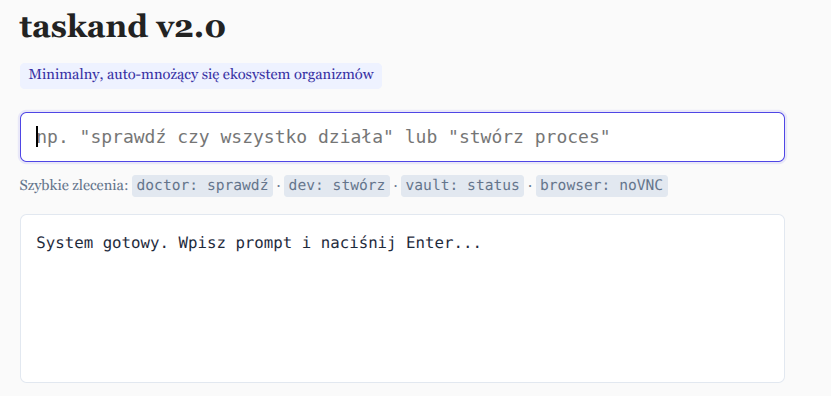

# taskand v2.0 — Minimalny, auto-mnożący się ekosystem (Standard v2.0)

> **taskand v2.0** redukuje złożoność systemu do zaledwie **5 kluczowych plików**. Likwiduje 5 zbędnych warstw pośredniczących i setki zduplikowanych plików z wersji legacy. Bootstrap (zygota) czyta genom, sprawdza dostępność klucza LLM (`TASKAND_LLM_API_KEY` z modelem **GLM-5.3**): jeśli klucz jest obecny — AI autonomicznie generuje kod procesów w locie; jeśli nie — system korzysta ze sprawdzonych, wbudowanych szablonów.

* **Oficjalne repozytorium**: https://github.com/semcod/taskand-glm53
* **Pełna specyfikacja Standardu v2.0**: [STANDARD-v2.0.md](STANDARD-v2.0.md) oraz [docs/standard-v2.0.md](docs/standard-v2.0.md)
* **Wcześniejsze wersje standardu**: [v1.6](docs/standard-v1.6.md) | [v1.5](docs/standard-v1.5.md) | [v1.4](docs/standard-v1.4.md) | [v1.1](docs/standard-v1.1.md)

---

## ⚡ Architektura: 5 plików, zero bloatu

W wersji v2.0 repozytorium nie zawiera setek zduplikowanych procesów ani preinstalowanych paczek:

```
taskand/
├── Dockerfile              ← bootstrap (zygota) — generuje i testuje procesy
├── docker-compose.yaml     ← gateway + Web Cockpit + VM browser (digital twin)
├── .env                    ← TASKAND_LLM_API_KEY=... (jedyny potrzebny sekret)
├── bin/
│   └── taskand            ← uniwersalne CLI (~150 linii, direct/gateway)
└── genome.yaml             ← deklaracja organizmów do wygenerowania

# Całość mieści się w 5 plikach. Reszta generowana w runtime do generated/.
```

### Porównanie z wersją v1.6

| Aspekt | v1.6 (legacy) | v2.0 (nowy standard) |
|---|---|---|
| **Liczba plików w repo** | 179 | **7** (5 plików bazowych + gateway + index) |
| **Katalogi w repo** | 277 | **3** (`bin/`, `log/`, `generated/`) |
| **Warstwy pośredniczące** | 7 (CLI → gateway → chat → nucleus → supervisor...) | **1** (CLI / Gateway → `bin.mjs`) |
| **Generowanie procesów** | Ręczne lub skomplikowane skrypty | **W locie przez model GLM-5.3 lub szablony** |
| **Replikacja zdalna** | Złożone skrypty instalacyjne | **Kopiowanie 5 plików przez SSH i `docker up`** |

---

## 💬 Interfejs Konwersacyjny CLI v2.0

```bash
# Rozmawiaj bezpośrednio z developerem (podłączony na żywo do GLM-5.3)
taskand dev "cześć, co potrafisz?"
taskand dev "stwórz proces liczący słowa"

# Sprawdź stan zdrowia systemu (strażnik SRE doctor)
taskand doc "sprawdź czy wszystko działa"

# Zarządzanie sejfem i poświadczeniami (vault AES-256-GCM)
taskand sec "status"

# Sterowanie zdalną sesją przeglądarki noVNC
taskand browser "otwórz https://example.com"

# Operacje na plikach na węźle mesh
taskand file "pokaż pliki"

# Telemetria sprzętu i GPIO
taskand hw "stan"

# Bezpośrednie wywołanie procesu proc://
taskand proc "proc://taskand.dev/chat/message/v1" '{"message": "hej"}'

# Inspekcja federacji i stanu
taskand status
taskand fed
taskand log 20
```

---

## 🚀 Szybki start

```bash
# 1. Sprawdź testy kontraktów wszystkich procesów (fail-closed)
make test

# 2. Uruchom usługi w tle (Bootstrap, Gateway API :8077, Web Cockpit :8090)
make up

# 3. Sprawdź stan systemu
make status

# 4. Zreplikuj system na zdalne urządzenie (np. Raspberry Pi 5)
./bin/taskand boot user@192.168.1.50
```

---

## 🌐 Web Cockpit

Po uruchomieniu `make up` (lub `python3 gateway.py`) interfejs Web Cockpit jest dostępny pod adresem:
* **http://localhost:8090** — minimalistyczny czat z organizmami taskand
* **http://localhost:8077/healthz** — stan zdrowia Gateway REST API
* **http://localhost:8077/api/federation** — rejestr procesów URI
