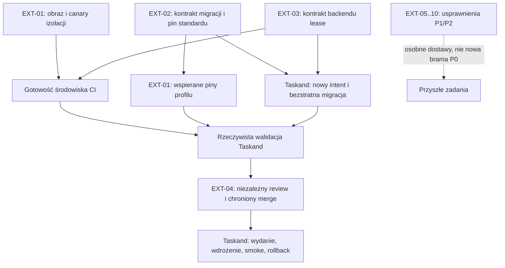

---
{
  "schema": "wellmanifest.docs/document/v1",
  "id": "external-dependencies-handoff",
  "kind": "refactoring-plan",
  "version": 1,
  "title": "Plan delegacji zależności zewnętrznych Taskand",
  "status": "proposed",
  "owner": "semcod/taskand-glm53",
  "created": "2026-09-14",
  "updated": "2026-09-14",
  "review_after": "2026-09-21",
  "source_revision": "881cb19f80a1ed76ef602e4c6dc99379dd54d228",
  "affected_repositories": ["semcod/taskand-glm53"],
  "evidence": [
    "https://github.com/semcod/taskand-glm53/pull/3",
    "https://github.com/subactor/onedev-agent/pull/315",
    "https://github.com/subactor/onedev-agent/issues/304",
    "repo://semcod/taskand-glm53/project/ticket-001/intent.json",
    "repo://semcod/taskand-glm53/docs/information/complementary-runtime.md",
    "receipt:sha256:af6c59f8c4869cbee8496884d336694525de2f960c0a0541efd7a2d91a2f23f4",
    "receipt:sha256:206d2a831958958714d3934ab1f1a0c7353887851c009942d57c3132372ffb74"
  ]
}
---

# Plan delegacji zależności zewnętrznych Taskand

<!-- docs:section goal -->
## 1. Cel i instrukcja przekazania

Odblokować chronioną publikację i prawidłowe uruchomienie `taskand-glm53`,
oddzielając pracę w aplikacji od pracy nad jej narzędziami i standardami.
Ten dokument jest **lokalnym planem potrzeb konsumenta Taskand**, nie zmianą
polityki innych repozytoriów ani centralnym raportem całej floty.
Wyniki przekrojowego audytu należą do `subactor/docs`; implementacja i jej
ticket pozostają u właściciela każdego wskazanego niżej repozytorium.

Drugiemu agentowi należy przekazać ten plik oraz wybrane identyfikatory `EXT-*`.
Są to identyfikatory sekcji planu, **nie zaalokowane tickety, działające URI
ani zarejestrowane URN**. Agent najpierw sprawdza stan swojego repozytorium,
odnajduje istniejący pasujący ticket i dopiero wiąże go z odpowiednim `EXT-*`.
Nie otrzymuje prawa zapisu w `taskand-glm53`, jego worktree ani konfiguracji
działającego Taskand. Nie należy uruchamiać wszystkich prac przez jednego
agenta jako jednego wielorepozytoryjnego changesetu.

Mierzalny wynik krytycznej ścieżki:

- zgodny, testowalny kontrakt migracji istniejącego snapshotu;
- wdrożony profil OneDev z potwierdzonym środowiskiem wykonania;
- rzeczywisty wynik CI dla dokładnego head/base/merge-result, następnie
  niezależny review i chroniony merge;
- osobno potwierdzone wydanie i wdrożenie Taskand. Ani dokument, ani HTTP 200
  nie zastępują tych dowodów.

Użytkownik 2026-09-14 zatwierdził **nowy jednorazowy kontrakt migracji 230
plików implementacyjnych na nowej gałęzi**, z zachowaniem starej historii,
bez force-push i bez pomijania testów oraz niezależnego review. Zgoda dotyczy
tej migracji, nie globalnego zwiększenia limitów, dowolnego następnego
snapshotu, usuwania danych czy zatwierdzenia nieznanego przyszłego HEAD.
Nowy kontrakt trzeba dopiero utworzyć i zwalidować; budżet obecnego ticketu
001 nie został tym dokumentem zmieniony.

<!-- docs:section current_state -->
## 2. Punkt wyjścia — obserwacje, nie obietnice

Obserwacje z 2026-09-14 odnoszą się do poniższych rewizji. Przed efektem
zewnętrznym każdy wykonawca ponawia odczyt; stare hashe nie są poleceniem
odtworzenia wcześniejszej konfiguracji.

| Obiekt | Zaobserwowany stan | Znaczenie |
| --- | --- | --- |
| Snapshot Taskand | `881cb19f80a1ed76ef602e4c6dc99379dd54d228`, draft PR #3 | Kod jest wypchnięty; brak chronionego merge |
| Docelowy `main` | `9f6da15c928ad6ecb89b54502d84a1d419c3f173` | Przodek snapshotu; nie ma wykazanego konfliktu tekstowego Git |
| Zakres PR | 325 zmienionych plików, z czego gate liczy 230 implementacyjnych przy limicie 15 | Nie mylić pełnego diffu z liczbą plików objętych budżetem |
| Governance Taskand | 10 błędów: historia intentu, budżet, zakres/własność oraz alarmy sekretów | Sam ponowny push, `git add` lub nowa nazwa brancha ich nie usuwa |
| Standard w Taskand | `new-project` 0.20.16, pin `6d2da011088b69ebe1636f3bf681e5ec21a062ab` | Nie podmieniać ręcznie zarządzanych kopii `.governance/*` |
| Testy lokalne snapshotu | Python 31 + 11 + 8 PASS; WWW 8/8 PASS | Wynik developerski, nie chroniony wynik OneDev |
| Zagnieżdżony sandbox | WWW 6/8; odmowa tworzenia przestrzeni nazw w próbie nested `bwrap` | Instalacja Chrome sama nie dowodzi gotowości izolacji |
| OneDev — źródła | PR #315 scalony do `fab395ab88d5064d92b9cb1f71eca86c6ddd9af1` | Profil Taskand i jego runner już istnieją; nie tworzyć ich ponownie |
| OneDev — wdrożenie | Preflight: `LOCAL_EXECUTOR_MISSING`; digest obserwowanego TOML `c0cb732df733b91ee9d74d91bbe9ed903174e786100eab9d6e556bcab6af7ad7` | Źródła, obraz, aktywna konfiguracja i wynik joba są różnymi etapami |
| Panel i gateway | 8090 serwuje stary Web Cockpit bez tokenu; `/api/mesh/state` zwraca 404 | Nowy panel i gateway nie są wdrożone jako zgodny zestaw |
| RPi `maskfleet5` | SSH do `pi@192.168.188.249` działa; loopback 8077 nie odpowiadał | Nie jest to dowód działającego peera Taskand ani pełny audyt hosta |
| Git lokalny | Primary i jeden powiązany delivery worktree były czyste, HEAD 881cb19 | Zachować je; nie są dwoma nowymi niezależnymi implementacjami |

W źródłach alarmy sekretów wskazują zarówno odczyty zmiennych środowiskowych,
jak i jawnie syntetyczne wartości testujące redakcję. Właściwy agent ma
odtworzyć dokładne findingi i sprawdzić nowe wersje skanera; nie wolno wyłączyć
skanowania, zmienić nazw zmiennych tylko w celu ukrycia alarmu ani uznać każdego
przyszłego dopasowania w tych plikach za false positive.

<!-- docs:section scope -->
## 3. Podział pracy i priorytety

`P0` oznacza bieżącą ścieżkę publikacji; `P1` zapobieganie powtórzeniu incydentu;
`P2` rozwój ewolucji i federacji. P1/P2 **nie stają się automatycznie bramkami**
obecnego PR. Najpierw sprawdzić, czy rozwiązanie już istnieje w przyjętej rewizji.
W takim przypadku wynikiem jest adopcja lub zweryfikowane `NO_CHANGE`, nie
kolejna implementacja tego samego mechanizmu.

| ID | Priorytet / właściciel | Co oddać Taskand | Równoległość |
| --- | --- | --- | --- |
| EXT-01 | P0 `subactor/onedev-agent` | Przypięte środowisko, aktywny profil i rzeczywisty canary | Przygotowanie równolegle z EXT-02/03; końcowy test po uzgodnieniu ich kontraktów |
| EXT-02 | P0 `wellmanifest/new-project` | Wykonalna, bezstratna procedura migracji i jej walidacja | Równolegle z provisionowaniem EXT-01; zmiany w tym repo serializowane |
| EXT-03 | P0 warunkowo `subactor/autonom` | Przenośny publiczny kontrakt backendu lease albo dowód, że obecny wystarcza | Audyt/API/testy równolegle; adapter w Taskand zmienia tylko agent Taskand |
| EXT-04 | P0 weryfikacja, P1 rozwój `subactor/validator-agent` | Preflight i chroniona ścieżka bez zgadywania readiness | Audyt od razu; merge Taskand dopiero po CI EXT-01 |
| EXT-05 | P1 `semcod/goal` | Reużycie świeżej walidacji, postęp i bezpieczne wznowienie publikacji | Niezależny changeset; integracja kontraktów po EXT-02/04 |
| EXT-06 | P1 `semcod/planfile` | Projektowe intake, spójna synchronizacja i projekcja dostawy | Równolegle z EXT-05; wspólny protokół z EXT-07 uzgodnić przed integracją |
| EXT-07 | P1 `wellmanifest/ticket-lifecycle`, potem `wellmanifest/git-lifecycle` | Stany, handoff, rejestracja i terminalne receipts | Osobne repozytoria/tickety, jeden uzgodniony kontrakt zdarzeń |
| EXT-08 | P1 `wellmanifest/worktrees` | Przyrostowy inventory i wybór resume/help/wait/new | Audyt równolegle; adopcja po uzgodnieniu EXT-07 |
| EXT-09 | P1 `wellmanifest/docs`, `wellmanifest/logs`; integracja w `new-project` | Rozdzielenie dokumentacji, auditów, logów i recovery | Rozłączne pakiety; integrację do `new-project` serializować za EXT-02 |
| EXT-10 | P2 `wellmanifest/taskand`, `wellmanifest/dsl`, `subactor/registry` | Wersjonowane kontrakty organizmów, modeli i reużycia | Projekt kontraktów równolegle; implementacja dopiero po ustaleniu właścicieli |

Ścieżki repozytoriów: `/home/tom/github/<owner>/<repo>`. Wymienione wyżej
lokalne katalogi sprawdzono. Katalogu `/home/tom/github/wellmanifest/reports`
nie znaleziono — nie oznacza to nieistnienia repozytorium zdalnego. Nie tworzyć
nowego standardu ani klonu w ciemno; najpierw odnaleźć jego właściwy HOME i
porównać odpowiedzialność z istniejącymi pakietami.

<!-- docs:section non_goals -->
## 4. Granice dla agentów zewnętrznych

- Bez zmian w `semcod/taskand-glm53`, jego `.worktrees`, `.env`, vault,
  danych kontekstu, kontenerach gateway/landing i wdrożeniu RPi.
- `taskand-gpt6` pozostaje całkowicie poza zakresem.
- Bez bezpośredniego merge, force-push, fałszywych statusów CI, wyłączania
  hooków, montowania prywatnego katalogu developera do joba lub `--privileged`.
- Bez masowej aktualizacji wszystkich adopterów naraz. Każdy adopter wymaga
  własnego aktualnego intentu, worktree, walidacji i wyniku publikacji.
- Nie zmieniać wspólnej konfiguracji OneDev/Validator bez ustalenia jej
  aktualnego właściciela, aktywnych jobów, przypięć i rollbacku.
- Nie uruchamiać obserwatorów prawdziwych sesji, skanowania sieci, logowania
  na stronach ani testów z rzeczywistymi poświadczeniami jako części CI.
- Nie utożsamiać zgody na migrację snapshotu z pozwoleniem na dodawanie
  niepowiązanych funkcji do tego samego changesetu.

<!-- docs:section evidence -->
## 5. Źródła do odczytu przed rozpoczęciem

1. Taskand: `project/ticket-001/intent.json`, `docs/information/complementary-runtime.md`,
   `docs/information/instance-network.md`, `project/lease-controller.py`,
   `tests/context_test.py`, `tests/mesh_test.py`, `tests/web_twin.test.mjs`,
   `generated/browser/web-model/taskand.dev/v1/cdp.mjs`. Dla innych agentów read-only.
2. OneDev: `config/repositories.toml`, `docker/pr/check-taskand.py`,
   `tests/test_taskand_verification.py`, `docs/information/taskand-verification.md`,
   `docker/pr/install-chromium.sh`, `docker/pr/Dockerfile.chromium-update`.
   Kontynuować zgłoszenie [#304](https://github.com/subactor/onedev-agent/issues/304)
   po sprawdzeniu aktualnego stanu; [#315](https://github.com/subactor/onedev-agent/pull/315)
   już zawiera implementację profilu.
3. New Project: `CONTRIBUTING.md`, `POLICY.md`, `governance/intent.schema.json`,
   `governance/manifest.schema.json`, `scripts/governance_check.py`,
   `scripts/create_adoption_lock.py`, `governance/diagnostics.json`,
   `docs/information/controlled-change-streaming.md`,
   `docs/CONTROLLED_CHANGE_STREAMING.md`, `error/GOV-APPROVAL.md`.
   Zweryfikować zmiany [#350](https://github.com/wellmanifest/new-project/pull/350)
   i [#353](https://github.com/wellmanifest/new-project/pull/353), nie odtwarzać ich z prozy.
4. Validator: `src/validator_agent/publication_preflight.py`,
   `src/validator_agent/local_reconcile.py`, `bin/run-local-direct-pr.sh`
   i rzeczywiście wdrożony chroniony rejestr. Nie kopiować sekretów do ticketu.
5. Goal: `goal/push/core.py`, `goal/governance/delivery.py`,
   `tests/test_delivery_integrity.py`, `tests/test_governance_delivery.py`.
6. Planfile: `planfile/core/store.py`, `planfile/core/decompose.py`,
   `planfile/sync/github.py`, `planfile/sync/state.py`,
   `planfile/cli/groups/ticket/commands.py`, `planfile/dsl/`.
7. Autonom: `autonom/change_lease.py`, `autonom/lease_keepalive.py`,
   `tests/test_change_lease.py`, `tests/test_lease_keepalive.py`, `pyproject.toml`.
8. Standard Taskand: `policy.json`, `schemas/`, `operations/`,
   `docs/standard.md`, `docs/digital-twin.md`. Pozostałe standardy: ich bieżące
   `README`, kontrakty operacji/modeli i testy, nie same historyczne przykłady.

Surowe dowody poprzedniej obserwacji są lokalnie pod
`/home/tom/.local/state/taskand/audits/taskand-runtime-canary-20260914.AfDsZr/`.
`governance.json` ma SHA-256 `af6c59f8c4869cbee8496884d336694525de2f960c0a0541efd7a2d91a2f23f4`,
a `web-twin-host.log` — `206d2a831958958714d3934ab1f1a0c7353887851c009942d57c3132372ffb74`.
To lokalne dowody, nie chronione atestacje ani publiczne odnośniki.
Nie kopiować pełnych logów do nowych repozytoriów.

<!-- docs:section target_design -->
## 6. Pakiety pracy

### EXT-01 — OneDev: środowisko i spójny profil weryfikacji

**Problem:** zaakceptowany profil źródłowy nie jest aktywnym profilem. Starsza
obserwacja obrazu wykazała brak Chrome/bwrap/backendu lease; test zagnieżdżenia
pokazuje, że obecność binarki nie rozwiązuje uprawnień do namespace.

1. Odczytać efektywną konfigurację, digest obrazu, mounty, overrides środowiska,
   kolejkę i istniejące receipts. `enabled=false` w pliku nie wystarcza do
   oceny, czy usługa jest wyłączona. Nie ujawniać wartości sekretów.
2. Przygotować przypięty obraz/kandydata konfiguracji przez istniejący proces
   wdrożeniowy. Nie edytować ręcznie pliku historycznego receiptu aktualnie
   używanego jako bind mount.
3. Uzgodnić z agentem Taskand przenośny wybór przeglądarki, profil izolacji
   oraz kontrakt instalacji backendu lease. Brak wymagań to osobny wynik
   `ENVIRONMENT_NOT_READY`, a nie pozorny sukces lub pominięcie testów.
4. Wykonać canary na kontrolowanych fixtures: browser nie czyta plików hosta,
   nie dociera do osiągalnego serwera hosta, replay działa po wyłączeniu źródła;
   lease odrzuca stale CAS i nie powiela efektu. Bez podpinania hostowego HOME.
5. Odseparować **gotowość infrastruktury CI** od **zielonego Taskand**.
   Środowisko może przejść własny canary, podczas gdy pełny test Taskand nadal
   poprawnie zwraca FAIL z powodu jego governance. Nie tworzyć zależności:
   „profil można przygotować dopiero po merge aplikacji, którą ma testować”.
6. Uzgodnić z EXT-02 wspierane immutable piny governance przed adopcją w
   Taskand. Autoryzowane przejście między dwiema wersjami nie może dawać PR-owi
   swobodnego wyboru własnego checkera.
7. Jeśli migracja będzie etapowa, przygotować jawny kontrakt pokrycia etapów:
   testy już obecne w zaakceptowanej bazie nie mogą zniknąć, nowe funkcje
   wprowadzają własne obowiązkowe testy, a końcowy snapshot ma pełne pokrycie.
   Nie zastępować wymagań regułą „testuj tylko istniejące pliki”.
8. Po niezależnym przyjęciu infrastruktury wykonać kontrolowane wdrożenie,
   readback profilu i job na dokładnej krotce PR/head/base/merge-result.

**Odbiór:** preflight rozpoznaje aktywny profil; gotowość sandboxu ma osobny
receipt; usunięcie obowiązkowego testu, skipped/todo i brak zależności pozostają
błędami. Błędny Taskand daje FAIL, poprawiony Taskand musi rzeczywiście dać PASS.
Inne repozytoria w OneDev zachowują swoje profile, dane kolejki i wymagania.

### EXT-02 — New Project: migracja zamiast pętli blokad

**Problem:** jedna dostawa łączy kod sprzed adopcji, adopcję i późniejsze
funkcje. Przypisanie całej historii do nowego małego ticketu nie odtwarza
historycznej intencji, a zwiększenie globalnych limitów przenosi problem dalej.

1. Na izolowanych fixtures odtworzyć: stary `main` bez standardu, opublikowany
   snapshot, pierwszą adopcję, późniejszy materiał oraz identyczny kod o innej
   historii. Nie wykonywać eksperymentów na referencjach Taskand.
2. Dostarczyć działającą procedurę wyboru: `resume`, bezstratny `split`,
   kontrolowane przejęcie albo nowy **jawny kontrakt migracji**. Ten ostatni
   musi wiązać dokładne repo/base/source/tree, inwentarz plików, zgodę na
   migrację, pochodzenie i zakres odstępstwa od zwykłego budżetu.
3. Dla zatwierdzonego przypadku Taskand umożliwić nową gałąź i nowy intent
   obecny przed pierwszym zapisem migracji. Nie fałszować autorstwa ani dat
   dawnych intentów. Zachować snapshot 881cb19 i odtwarzalną historię.
4. Nie interpretować zgody na 230 plików jako stałego limitu dla wszystkich
   ticketów. Nowe naprawy poza zinwentaryzowanym snapshotem mają oddzielnie
   policzony, zatwierdzony zakres; nie mogą „schować się” w imporcie.
5. Jeżeli obecny runtime nie reprezentuje takiego kontraktu, zmienić schema,
   walidator, katalog diagnostyczny, runbook i testy w repo standardu. Wykazać
   odmowę dla niezgodnego SHA, dopisanego pliku, obcego repo, brakującej zgody,
   utraconej historii oraz ponownego użycia skonsumowanego uprawnienia.
6. Oddzielić błędy historyczne, błędy kandydata i preconditions publikacji w
   raporcie. Dostarczać bezpieczny następny krok oraz właściciela problemu,
   bez zmieniania `FAILED` na `PASSED` samą klasyfikacją.
7. Sprawdzić alarmy sekretów w dostępnej nowszej wersji standardu. Gdy problem
   nadal występuje, dodać precyzyjne regresje dla odczytów env i syntetycznych
   fixtures, równocześnie zachowując wykrywanie prawdziwych wartości. Nie
   stosować wyjątku dla całych plików ani zgadywania, że sekret jest testowy.
8. Opublikować małe, zależne zmiany standardu normalnym procesem; oddać pełny
   SHA, wersję, manifest/lock i polecenie obsługiwanej adopcji. Agent Taskand
   wykonuje adopcję u siebie dopiero po uzgodnieniu pinów z EXT-01.

**Odbiór:** niezmieniony mały projekt zachowuje dotychczasową ochronę;
zatwierdzona migracja ma przeliczalną ścieżkę przejścia, a brak/zmiana jej
uprawnienia lub zakresu nadal blokuje efekt. Procedura nie wymaga kolejnego
ratunkowego pushu, edycji adoptera ręcznie ani wymazania starej gałęzi.

### EXT-03 — Autonom: przenośny backend blokad

**Problem konsumenta:** `project/lease-controller.py` w Taskand wskazuje
konkretny prywatny katalog `/home/tom/...`. Istnieje też adapter korzystający
z prywatnych metod backendu. Nie dowodzi to błędu w samym Autonom.

1. Zweryfikować obecny pakiet i publiczne API; oddać `NO_CHANGE`, jeśli
   backend już można instalować i wywoływać przenośnie.
2. Jeżeli brakuje kontraktu, wystawić wersjonowane API/CLI dla acquire,
   heartbeat, transition i odczytu receipt, z jawnym katalogiem stanu,
   tożsamością worktree oraz pinem artefaktu. Nie kopiować kodu per język.
3. Zapewnić zgodność obecnych zapisów i odmowę nieobsługiwanej wersji.
   Atomowość, wygasanie, CAS, monotoniczny fencing i idempotencja pozostają
   testowane po restarcie oraz przy konkurujących writerach.
4. Rozróżnić `single-host cooperative` od blokady rozproszonej. Lokalny
   `flock` nie jest arbitrem między nvidia a RPi. Dla zakresu wielowęzłowego
   jawnie wybrać wspólny kontroler lub odmówić nieobsługiwanej topologii.

**Odbiór:** instalacja w czystym środowisku działa bez prywatnego HOME;
zduplikowane requesty dają jeden efekt; obcy/stary fencing jest odrzucany.
Zmianę adapteru i zależności w Taskand wykonuje wyłącznie jego agent.

### EXT-04 — Validator: jedna ścieżka publikacji i użyteczny preflight

Istniejący `bin/run-local-direct-pr.sh --preflight` jest punktem startowym,
nie należy pisać drugiego publikatora. Najpierw zweryfikować profil Taskand,
chroniony digest rejestru, istniejący job/review i pozostałe wymagane checks.

Jeżeli aktualny produkt nie rozdziela etapów, uzupełnić jego wynik o
obserwacje `declared/configured/deployed/verified`, exact head/base oraz
właściciela brakującej zależności. `mergeable` z GitHub nie oznacza readiness.
Zduplikowane lub ponowione żądanie ma odczytać dziennik i stan GitHub przed
efektem; nie tworzyć drugiego review/merge wskutek timeoutu odpowiedzi.

**Odbiór:** zmiana head/base/pinów unieważnia odpowiednie dowody, timeout po
wykonanym merge nie powoduje ponowienia, brak profilu daje diagnostykę bez
używania klucza App. Istniejący model rozdzielenia CI, autora, review i merge
pozostaje nienaruszony. Zmiana listy required checks wymaga własnej chronionej
migracji, nie poprawki w PR Taskand.

### EXT-05 — Goal: szybsze kontrole bez cache'owania uprawnień

W odczytanym `goal/push/core.py` występują dwa wywołania
`validate_delivery_ready`; `goal/governance/delivery.py` uruchamia kosztowny
health kontraktu źródłowego. Najpierw pomiar konkretnej ścieżki — dwa wywołania
funkcji nie dowodzą, że w każdej konfiguracji można jedno usunąć.

1. Rozdzielić tani odczyt stanu od kosztownej, deterministycznej walidacji.
2. Klucz reuse ma obejmować rzeczywisty zakres testu: tree/stan roboczy i indeks,
   base/head/merge-base, intent, policy, lock, konfigurację poleceń, runtime
   i obraz. Nie przekazywać PASS dla zmienionych nieśledzonych wejść testu.
3. Przed każdym efektem zawsze ponawiać wymagane odczyty head, lease,
   uprawnień, freeze i zewnętrznych checks. Wynik testu nie jest cache'em zgody.
4. Dodać postęp faz/testów, czas oczekiwania i wskazanie następnego działania;
   proponowany cel: aktualizacja co najwyżej co 30 sekund długiej fazy.
5. Po timeoutie wznowić tę samą transakcję z idempotency key; nie tworzyć
   nowej gałęzi/ticketu ani nie zmieniać komunikatów historycznych commitów
   bez osobnej autoryzacji takiej operacji.

**Odbiór:** niezmieniony testowany subject w jednym przebiegu nie uruchamia
tej samej kosztownej bramy drugi raz; zmiana każdego istotnego wejścia daje
cache miss. Tests/reference checks zachowują wynik i ochronę sprzed optymalizacji.

### EXT-06 — Planfile: powiązania, synchronizacja i widoczny zastój

Taskand ma już lokalny pilot `semcod/taskand-glm53:PLF-001` w
`.subactor/recovery/planfile`, powiązany z issue #2 i PR #3. To projekcja,
nie dowód automatycznej synchronizacji. Nie używać domyślnego projektu
operatora zamiast jawnego project root/store.

1. Powiązać intake jednym stabilnym kluczem z governance ticket, workstream,
   branch, worktree, lease, PR i dokładnym subjectem. Reuse przed allocate.
2. Zastosować istniejące DSL/CLI/SDK i adapter GitHub. Nie zastępować ich
   prywatnymi skryptami `gh issue create` przy każdym wznowieniu.
3. Jawnie ustalić właściciela każdego pola: intent/zakres w jego kontrakcie,
   efekt GitHub w GitHub/receipcie, lokalny workspace w inventory, Planfile
   jako projekcja. Nie rozstrzygać konfliktu automatycznie „ostatnim zapisem”.
4. Zapewnić trwały outbox, bounded retry, obserwację po niepewnym timeoutie,
   deduplikację i stan `sync_pending` zamiast tworzenia kolejnych issue/PR.
5. Publikować w CLI/API fazę, ostatni materialny postęp, blocked reason,
   właściciela zależności i `nextAction`. Długie testy, cudzy aktywny job
   i brak autoryzacji wymagają różnych reakcji.
6. Wymuszenie zależności Planfile w adopterach najpierw uzgodnić w EXT-07
   i `new-project`: pin, instalacja, upgrade, dostęp offline i bezpieczny
   recovery. Nowa obowiązkowa usługa nie może zablokować naprawy samej usługi.

**Odbiór:** dwa równoległe intake i timeout po utworzeniu issue dają jeden
obiekt z zachowanym lokalnym zamiarem; obcy projekt/niezgodny revision/CAS są
odrzucane. Brak sieci pozostawia jednoznaczne zadanie do wznowienia.

### EXT-07 — Ticket/Git lifecycle: wspólne stany, rozłączne skutki

Najpierw `wellmanifest/ticket-lifecycle` uzgadnia stany i kontrakt powiązań
z EXT-06; `wellmanifest/git-lifecycle` definiuje skutki Git i ochronę historii.
Każdy pakiet ma własny ticket, wersję i publikację; nie duplikować SSOT operacji
w kilku rejestrach.

- Określić, kiedy wymagane są branch, lokalne trwałe intake, issue i PR.
  Natychmiastowy ślad lokalny przed zapisem; draft PR najpóźniej przy
  pierwszym materialnym pushu, jeśli taki profil przyjmie repozytorium.
- Nie wymagać zdalnego issue do read-only diagnozy offline. Dla publikacji
  rozliczyć brakujący etap przez idempotentny adapter, nie pominąć go.
- Rozróżnić writer lease, oczekiwanie na review i terminalny merge.
  Blokowana publikacja nie powinna trzymać bez potrzeby rezerwacji edycji;
  wznowienie zawsze wymaga nowej aktualnej obserwacji i fencing.
- Dla split/handoff/supersede zachować poprzednika do zweryfikowania następcy;
  nie zamykać zamiaru dlatego, że istnieje archiwum kodu.
- Oddzielić bezpieczny push reviewable work od zgody na merge/release.
  Gdy potrzebny jest profil draft/WIP, musi być jawny i zgodny z ochroną
  sekretów, zakresu oraz provenance — nie dorozumiany bypass błędnej bramy.

**Odbiór:** scenariusze dwóch agentów, utraty lease, restartu po pushu,
zamknięcia PR bez merge i awarii po merge mają jeden rozliczalny wynik;
cleanup nie usuwa cudzych zmian ani nie tworzy commitów wyłącznie do zamknięcia.

### EXT-08 — Worktrees: inventory pomaga kończyć, nie mnożyć

Nie zmieniać v5 tylko dlatego, że dwa checkouty współdzielą HEAD. Inventory
ma opisywać role, właścicieli, dirty delta, relację do main i publicznych
referencji, PR oraz lease. Porównywać rzeczywiste nowe delty względem wspólnego
przodka, nie całą wspólną historię jako rzekomy konflikt.

Przed nowym developmentem proponować `resume`, pomoc we wznowieniu istniejącej
dostawy, `wait`, jawny handoff lub dopiero nowe rozłączne zadanie. Przyjąć
częściowy wynik inventory z błędem konkretnego repo zamiast blokować cały host
z powodu jednego nieosiągalnego remote. Brak wiedzy o danym zakresie nadal
wyklucza skutki w tym zakresie.

**Odbiór:** identyczny czysty snapshot nie jest konkurującym writerem;
rzeczywiste nakładające się zapisy są wykrywane; read-only inventory nie usuwa
i nie naprawia rejestracji. Cleanup wymaga exact path/ref, klasyfikacji danych,
rozliczenia zamiaru i odpowiedniego receiptu z EXT-07.

### EXT-09 — Dokumentacja, audyty, logi i diagnostyka

Właściciele mają najpierw ustalić granice istniejących standardów, a nie
tworzyć kolejny ogólny rejestr „wszystkiego”.

- `wellmanifest/docs`: trwałe plany i raporty, indeksy, metadane. Sprawdzić
  zaobserwowaną kolizję z wymaganymi przez New Project plikami `error/*.md`:
  rozpoznawać zarejestrowany kontrakt/runbook, nie ignorować całego katalogu.
- `wellmanifest/logs`: kształt zdarzeń, korelacja, redakcja i katalog błędów.
  Plain text, JSON, JSONL, stderr i traceback normalizować z zachowaniem
  pochodzenia, digestu i wersji parsera; nie rozpoznane dane są `unclassified`.
- `new-project`: powiązanie dowodów z intentem, continuity, releasem i recovery.
  Raw logi/snapshoty pozostają w prywatnym magazynie; lokalny indeks przy repo
  może wskazywać artefakty, ale sam nie jest zewnętrznym trwałym receiptem.
- `subactor/docs`: jeden przekrojowy raport adopcji i wdrożeń. Nie kopiować
  go w całości do każdego adoptera.

**Odbiór:** plan i runbook są odnajdywalne; wymagany runbook przechodzi
kompozycję standardów, obcy dokument ukryty w `error/` nie omija kontroli.
Sekret w surowym błędzie nie trafia do modelu ani publicznego repo. Dane logu
nie mogą zmieniać instrukcji agenta ani nadawać zgody na naprawę.

### EXT-10 — Taskand/DSL/Registry: kontrakty długoterminowe, bez blokowania P0

To propozycja dalszej pracy, nie diagnoza, że wszystkie poniższe mechanizmy
są nieobecne. Porównać aktualne katalogi i testy przed dodawaniem schematów.

1. `wellmanifest/taskand` definiuje kontrakt manifestu organizmu: procesy,
   błędy, stany, typy, deklarowane zmienne, wejścia/wyjścia, runtime i izolacja.
   `wellmanifest/dsl` odpowiada za gramatykę i reguły walidacji/projekcji,
   a `subactor/registry` za rozwiązywanie, odkrywanie i publikację bindingów.
2. Oddzielić wersję standardu, gramatyki, schema payloadu, procesu i instancji.
   URI służy odnajdywaniu/wywołaniu; URN identyfikuje obiekt. Rozwiązywanie
   kontekstu wiąże konkretną rewizję i digest, a nie samo ruchome `latest`.
3. Wspólna koperta może wskazywać DSL i schema payloadu; komenda zadania,
   bezskutkowe query i zdarzenie logu mają odrębne kontrakty semantyczne.
   Log jest dowodem, nie autoryzacją. Nieznana wersja nie jest zgadywana.
4. Parametry i plan wyprowadzać z zaakceptowanego NL oraz rozwiązanych rejestrów.
   Sprawdzać wszystkie URI/URN, zamknięte schematy i DAG przed dispatch.
   Deklaracja GBNF nie oznacza, że provider faktycznie ją egzekwuje.
5. Kompozycja twinów przypina wersje części, zgodność typów, zakres obserwacji,
   ograniczenia modelu i provenance. Nieznane urządzenie zachowuje stan
   `UNKNOWN`; synthetic user twin nie jest tożsamością ani zgodą człowieka.
6. Zmiana runtime deklaruje wymagane możliwości. **Dockerfile nie musi być
   osobny dla każdego organizmu**: można współdzielić przypięty obraz/profil,
   jeśli runner i testy dowodzą wymaganej izolacji oraz kompatybilności.
7. Te same wektory testowe uruchomić dla adapterów MJS i Python: odczyt starej
   wersji, brakujące referencje, zmieniony hash, obcy tenant i nieznany enum.
8. Dla peerów: uwierzytelniona tożsamość węzła, negocjacja możliwości transportu,
   timeout i idempotencja. Odkrycie przez landing page/chat nie daje prawa
   wykonania. Fallback transportu nie może zmniejszać wymaganej ochrony.
9. Samodoskonalenie zaczyna się od zredagowanego incydentu i propozycji zadania;
   reprodukcja w twinie, test, ocena skutku i autoryzacja kontrolera są osobne.
   Nie uruchamiać automatycznej pętli zmian produkcyjnych na podstawie tekstu błędu.

**Odbiór:** wersjonowane kontrakty i conformance fixtures mają jednego
właściciela, referencje rzeczywiście rozwiązują się w registry, a stary
konsument odczytuje wspierane dane lub dostaje stabilną, bezpieczną odmowę.
Implementacja funkcji w aplikacji pozostaje kolejnym zadaniem Taskand.

<!-- docs:section migration -->
## 7. Harmonogram i zależności integracji

Fala 1: start EXT-01, EXT-02, audyt EXT-03 oraz read-only EXT-04.
Agent Taskand przygotowuje własny nowy kontrakt migracji, inwentarz oraz
testy przenośności; nie czeka na ukończenie wszystkich usprawnień P1/P2.
Kontrakt stykowy browser/lease/piny trzeba uzgodnić przed zmianą konsumentów.

Fala 2: niezależnie EXT-05, EXT-06 i audyty EXT-08/09; EXT-07 publikuje
uzgodnione reguły, które konsumują narzędzia. W `new-project` jeden writer
integruje kolejne zaakceptowane pakiety, nie kilku agentów na tych samych
schematach i manifestach naraz. Integracja EXT-10 ma osobny termin i ticket.

Jeśli dostępny jest tylko **jeden agent zewnętrzny**: najpierw dostarczyć
przygotowanie środowiska EXT-01 i uzgodnienie wymagań, potem EXT-02,
warunkowo EXT-03, wrócić do canary/pinów EXT-01, a następnie EXT-04.
Nie otwierać od razu dziesięciu aktywnych worktree. Z kilkoma agentami
równoległość jest możliwa między rozłącznymi właścicielami i zasobami;
zmiana wspólnego runtime/deployment pozostaje serializowana.

Każda fala kończy się odbiorem konkretnego artefaktu. Przesunięcie main bez
nakładania się zakresu nie powinno wymuszać ponownej zgody człowieka; aktualny
target i wynik integracji nadal muszą być sprawdzone zgodnie z obowiązującą
polityką. Proponowane uproszczenia stosować dopiero po ich przyjętej adopcji.

<!-- docs:section acceptance -->
## 8. Kontrakt odbioru od drugiego agenta

Raport ma zawierać poniższe pola jako dane, nie wyłącznie opis „gotowe”.
Jest to wymagana zawartość handoffu; **nie deklaracja już zarejestrowanego
nowego schematu**. Wykonawca mapuje ją na istniejący typed receipt/Planfile,
a nowy schema rejestruje u właściciela przed użyciem produkcyjnym.

| Pole | Wymagana zawartość |
| --- | --- |
| work item | `EXT-*`, repozytorium, rzeczywisty ticket i jego intent digest |
| subject | branch, base/head/merge SHA, PR URL; brak wartości oznaczyć jako brak |
| ownership | dokładne zmieniane ścieżki, workstream, lease/fencing ref bez sekretów |
| artifact | wersja, pełny source SHA, hash locka/pakietu; obraz także z digestem |
| verification | polecenia, środowisko, PASS/FAIL/SKIP, log/receipt ref i digest |
| lifecycle | osobne stany source, PR, merge, package, deployment, canary |
| adoption | obsługiwana procedura i wejścia adopcji przez agenta Taskand |
| rollback | poprzedni znany dobry artefakt, sposób przywrócenia i wynik testu |
| remaining | brakujące kryteria, owner, nextAction oraz warunek wznowienia |
| authority | źródło autoryzacji skutku; lokalny raport pozostaje obserwacją |

`NO_CHANGE` jest prawidłowym wynikiem, jeśli istniejące opublikowane rozwiązanie
spełnia kryteria i wskazano dowody jego użycia. Nie tworzyć ticket-only PR.
Nie zgłaszać `MERGED`, gdy istnieje tylko lokalny commit, ani `DEPLOYED`,
gdy zmiana jest wyłącznie w domyślnej gałęzi źródeł.

<!-- docs:section validation -->
## 9. Obowiązkowe scenariusze regresji dla proponowanych zmian

| Scenariusz | Oczekiwany wynik / właściciel |
| --- | --- |
| Dwa żądania tego samego push/review/issue | Jeden efekt; obserwacja po timeoutie, bez ślepego retry — EXT-04/05/06 |
| Zmiana head, base, intentu, locka albo obrazu po teście | Unieważnienie odpowiednich dowodów; brak użycia starej zgody — EXT-01/04/05 |
| Awaria procesu po wysłaniu efektu, przed zapisem lokalnym | Readback zewnętrzny i uzgodnienie dziennika — EXT-04/05/06/07 |
| Przerwany/niezgodny import lub dodatkowy plik w migracji | Odmowa i zachowana historia; zwykłe limity nadal chronią nowe zadania — EXT-02 |
| Wspólny czysty HEAD oraz osobno realny konflikt dirty delta | Pierwszy nie mnoży ticketów, drugi zatrzymuje właściwy zakres — EXT-07/08 |
| Missing Chrome/backend, skipped test, pusty test suite | Jawna porażka odpowiedniego kryterium, nie PASS — EXT-01 |
| Replay WWW przy wyłączonym źródle; odczyt pliku/sieci hosta | Replay działa, dostęp poza modelem jest odrzucony — EXT-01 + agent Taskand |
| Brak GitHub / błąd API po skutecznym utworzeniu obiektu | Trwałe pending, pojedynczy intake, bez duplikatu — EXT-06 |
| Sekret, prompt injection lub nieznany format w logu | Redakcja/kwarantanna; dane nie zmieniają authority — EXT-02/09/10 |
| Dwa węzły, niezgodna wersja, obcy tenant, utrata lease | Brak podwójnego skutku i jawna odmowa nieobsługiwanego trybu — EXT-03/10 |

Polecenia testów brać z aktualnego kontraktu właściciela. W docelowym Taskand
pełny zakres obejmuje governance, registry conformance, contracts, negative
authority, integration, network twin, WWW twin oraz Python context/mesh/observers.
Testy modyfikujące fixtures rejestru uruchamiać kolejno na izolowanej kopii.
Nie uruchamiać całego Make targetu na produkcyjnych danych lub działającym
gateway tylko dlatego, że lokalny token pozwala na wywołanie.

<!-- docs:section rollback -->
## 10. Rollback i zatrzymanie eskalacji

- Przed zmianą współdzielonego OneDev/Validator zachować dokładny obraz,
  konfigurację, wersję schematu danych i stan kolejki; przećwiczyć powrót.
  Nie wracać do starego pliku nadpisując niezależne późniejsze zmiany.
- Adopcje standardu przypinać po SHA i wykonywać zarządzanym generatorem.
  Wadliwą wersję zastępuje się nową zaakceptowaną wersją/obsługiwanym rollbackiem,
  nie ręczną zmianą hashy lub przepinaniem istniejącego taga.
- Nie usuwać poprzednika migracji ani jego danych tylko dlatego, że istnieje
  successor PR. Najpierw rozliczyć kryteria i uzyskać chronione receipts.
- Po powtarzającym się identycznym błędzie bez nowej obserwacji zatrzymać
  ponawianie tego efektu, zapisać owner/nextAction i kontynuować rozłączne prace.
  Limit prób wynika z kontraktu operacji, nie z arbitralnej pętli agenta.
- Dla awarii o nieznanym wyniku oznaczyć `outcome_unknown`; nie ponawiać
  write/deploy przed readback. Dla zagrożenia sekretów, destrukcji lub braku
  zgody zatrzymać efekt natychmiast, zachowując bezpieczne dowody.

<!-- docs:section risks -->
## 11. Ryzyka i ograniczenia tego planu

Największe ryzyko organizacyjne to uzależnienie publikacji jednego produktu
od przebudowy całego ekosystemu. Dlatego P0 jest małą ścieżką krytyczną,
a optymalizacje P1/P2 mają niezależny odbiór. Nie zmieniać listy wymaganych
bramek bieżącej dostawy samym dopisaniem zadania do tego dokumentu.

Największe ryzyko techniczne to mylenie stanów source/deployed oraz zaufania
do danych z uprawnieniem. Drugi agent ma rewalidować zastany stan, nie
wykonywać dosłownie historycznych poleceń z audytu. Zakresy plików z sekcji 5
są punktami startowymi odczytu, nie automatycznymi `allowedPaths` do zapisu.

Wersje źródeł i stan innych repozytoriów mogą zmieniać się równolegle.
Nie zakładamy, że wszystkie repo są czyste, że nie ma innych agentów lub że
lokalny `main` jest aktualny. W szczególności nie należy automatycznie
sprzątać odziedziczonych worktree w `new-project` i OneDev.

Sam plan nie uruchamia agentów, nie tworzy zdalnych zgłoszeń, nie wdraża
profilu CI i nie ustanawia nowych schematów. Brak canary nadal jest brakiem.

<!-- docs:section ownership -->
## 12. Co pozostaje wyłącznie po stronie agenta Taskand

1. Nowy, zarządzanie zaalokowany kontrakt/branch migracji zgodnie z otrzymaną
   zgodą, rozliczenie 230 plików i ewentualnych nowych napraw; zachowanie 881cb19.
2. Implementacja przenośnego adapteru lease i wyboru browsera, aktualizacja
   odpowiednich bindingów rejestru oraz testów — bez kopiowania sekretów.
3. Adopcja zaakceptowanych standardów, po uzgodnieniu wersji z OneDev.
4. Uruchomienie pełnych testów, publikacja reviewable PR i przekazanie go
   istniejącemu niezależnemu Validatorowi; readback terminalnego merge.
5. Wydanie artefaktu z jawnie określonym kanałem dystrybucji. Nie nazywać
   `VERSION=3.0.0-dev`, samego pushu ani lokalnego obrazu opublikowaną paczką.
6. Dopiero po wymaganych bramkach zgodne wdrożenie gateway + panelu, smoke
   test autoryzowanej komunikacji, diagramu i planowania; poprzedni snapshot
   zachować jako zweryfikowany rollback.
7. Osobne kwalifikowane wdrożenie na RPi, parowanie tożsamości, test komunikacji
   z nvidia oraz odróżnienie lokalnego modelu od prawdziwego peera.
8. Dopiero później nowe funkcje autonomii, obserwatorów i ewolucji. Produkcyjne
   skutki pozostają za bramką twin + właściwą decyzją człowieka/kontrolera.

Agent zewnętrzny oddaje wyniki z sekcji 8 i zwalnia swoją rezerwację po
osiągnięciu właściwego stanu. Agent Taskand sprawdza je przed adopcją.
Odpowiedzialność nie przenosi się przez deklarację „gotowe” w czacie.
