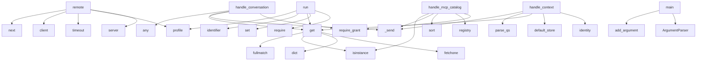

# System Architecture Analysis
<!-- generated in 0.01s -->

## Overview

- **Project**: /home/tom/github/paxlet-com/taskand
- **Primary Language**: md
- **Languages**: md: 44, python: 33, yaml: 9, shell: 5, javascript: 4
- **Analysis Mode**: static
- **Total Functions**: 276
- **Total Classes**: 13
- **Modules**: 105
- **Entry Points**: 162

## Architecture by Module

### operations.delivery
- **Functions**: 49
- **File**: `delivery.mjs`

### scripts.runtime
- **Functions**: 24
- **File**: `runtime.sh`

### packages.taskand-mcp-control.control
- **Functions**: 21
- **Classes**: 2
- **File**: `control.py`

### operations.delivery_controller.test
- **Functions**: 19
- **File**: `delivery_controller.test.mjs`

### gateway.context
- **Functions**: 15
- **Classes**: 2
- **File**: `context.py`

### examples.web-twin-task
- **Functions**: 13
- **File**: `web-twin-task.mjs`

### examples.network-scan-task
- **Functions**: 12
- **File**: `network-scan-task.mjs`

### scripts.install-agent-hosts
- **Functions**: 11
- **File**: `install-agent-hosts.sh`

### infra.local-recovery.context_snapshot
- **Functions**: 11
- **Classes**: 1
- **File**: `context_snapshot.py`

### infra.local-recovery.deploy
- **Functions**: 11
- **File**: `deploy.py`

### packages.taskand-mcp.src.taskand_mcp.gateway
- **Functions**: 10
- **Classes**: 3
- **File**: `gateway.py`

### mcp.bridge
- **Functions**: 10
- **Classes**: 1
- **File**: `bridge.py`

### mcp.catalog
- **Functions**: 10
- **File**: `catalog.py`

### gateway
- **Functions**: 7
- **Classes**: 1
- **File**: `__init__.py`

### gateway.auth
- **Functions**: 7
- **File**: `auth.py`

### wellmanifest_governance
- **Functions**: 6
- **Classes**: 1
- **File**: `wellmanifest_governance.py`

### gateway.handlers.observers
- **Functions**: 5
- **File**: `observers.py`

### app.runtime_canary
- **Functions**: 5
- **File**: `runtime_canary.py`

### app.runtime_readiness
- **Functions**: 5
- **File**: `runtime_readiness.py`

### gateway.handlers.monag_handler
- **Functions**: 4
- **File**: `monag_handler.py`

## Key Entry Points

Main execution flows into the system:

### packages.taskand-mcp-control.control.Control.remote
- **Calls**: self.server, self.profile, asyncio.timeout, self.client, next, packages.taskand-mcp-control.control.require, packages.taskand-mcp-control.control.require, None.fetchone

### gateway.handlers.proc.handle_conversation
> Conversation only: a fixed LLM URI, no intent dispatch or tool execution.
- **Calls**: gateway.auth.require_grant, body.get, os.environ.get, handler._send, any, handler._send, gateway.utils.call_process, urlsplit

### packages.taskand-mcp-control.control.Control.run
- **Calls**: packages.taskand-mcp-control.control.require, set, data.get, packages.taskand-mcp-control.control.identifier, self.profile, packages.taskand-mcp-control.control.require, packages.taskand-mcp-control.control.identifier, self.lock

### gateway.handlers.context.handle_mcp_catalog
> Authenticated metadata projection, with a read-only dashboard capability.

This capability grants no registry/core call, admission or tool execution.

- **Calls**: gateway.auth.require_grant, examples.network-scan-task.registry, tools.sort, handler._send, isinstance, source.get, handler._send, entry.get

### mcp.catalog.main
- **Calls**: argparse.ArgumentParser, parser.add_argument, parser.add_argument, parser.add_argument, parser.add_argument, parser.add_argument, parser.add_argument, parser.add_argument

### gateway.handlers.context.handle_context
- **Calls**: gateway.handlers.context.identity, gateway.context.default_store, body.get, parse_qs, handler._send, gateway.auth.check_grant, handler._send, store.profile

### gateway.context.Store.get
- **Calls**: None.fetchone, dict, isinstance, EVENT_URN.fullmatch, None.fetchone, dict, ContextError, ContextError

### app.runtime_readiness.main
- **Calls**: argparse.ArgumentParser, parser.add_argument, parser.add_argument, parser.add_argument, parser.add_argument, parser.add_argument, parser.add_argument, parser.parse_args

### gateway.context.Store._put
- **Calls**: gateway.context.packed, db.execute, self.get, ContextError, self.get, self.get, ContextError, str

### gateway.GatewayHTTPHandler.do_POST
- **Calls**: gateway.auth.check_auth, int, json.loads, self._send, body.pop, body.pop, body.pop, body.pop

### packages.taskand-mcp-control.control.Control.profile
- **Calls**: None.get, packages.taskand-mcp-control.control.require, packages.taskand-mcp-control.control.require, packages.taskand-mcp-control.control.require, profile.get, packages.taskand-mcp-control.control.require, profile.get, packages.taskand-mcp-control.control.require

### app.runtime_readiness._probe
- **Calls**: time.monotonic, http.client.HTTPConnection, connection.request, connection.getresponse, round, TimeoutError, response.read, connection.close

### gateway.context.Store.begin
- **Calls**: ContextError, self.connect, db.execute, gateway.context.prompts, self._put, db.execute, str, isinstance

### packages.taskand-mcp.src.taskand_mcp.gateway.Gateway.request
- **Calls**: packages.taskand-mcp.src.taskand_mcp.gateway.encode, GatewayError, json.loads, len, asyncio.timeout, ValueError, GatewayError, GatewayError

### packages.taskand-mcp-control.control.Control.execute
- **Calls**: packages.taskand-mcp-control.control.identifier, packages.taskand-mcp-control.control.identifier, gateway.handlers.observers.digest, None.fetchone, self.receipt, data.get, data.get, packages.taskand-mcp-control.control.require

### packages.taskand-mcp-control.control.main
- **Calls**: os.umask, scripts.install-agent-hosts.print, sys.stdin.buffer.read, packages.taskand-mcp-control.control.require, packages.taskand-mcp-control.control.envelope, Control, control.consume, packages.taskand-mcp-control.control.canonical

### wellmanifest_governance.pytest_sessionstart
> Run repository governance once before pytest collects product tests.
- **Calls**: getattr, getattr, None.resolve, wellmanifest_governance._activate_managed_hook, wellmanifest_governance._resolve_base, wellmanifest_governance._changed_paths, dict, subprocess.run

### gateway.context.Store.profile
- **Calls**: any, ContextError, ContextError, ContextError, ContextError, self.connect, db.execute, self._put

### infra.local-recovery.deploy.main
- **Calls**: argparse.ArgumentParser, parser.add_argument, parser.add_argument, parser.add_argument, parser.add_argument, parser.add_argument, parser.add_argument, parser.add_argument

### gateway.handlers.mcp_control.authorize
- **Calls**: os.environ.get, json.dumps, handler._send, gateway.auth.check_grant, handler._send, len, handler._send, data.get

### gateway.handlers.chat.handle_chat
> Jedna ścieżka: dev/chat trasuje organizmy i intencje; gateway nie zna organizmów ani LLM.
- **Calls**: None.strip, gateway.auth.require_grant, None.lower, gateway.middleware.logging.log_event, gateway.utils.call_process, request_handler._send, request_handler._send, result.get

### infra.local-recovery.context_snapshot.main
- **Calls**: argparse.ArgumentParser, parser.add_argument, parser.add_argument, parser.add_argument, parser.add_argument, parser.add_argument, parser.add_argument, parser.parse_args

### operations.delivery.deliver
- **Calls**: operations.delivery.parseDeliveryArgs, operations.delivery.buildDeliveryPlan, operations.delivery.statePath, operations.delivery.readState, operations.delivery.digest, operations.delivery.writeState, operations.delivery.Boolean, operations.delivery.Map

### mcp.bridge.main
- **Calls**: scripts.install-agent-hosts.print, mcp.bridge.load_json, Path, mcp.bridge.require, mcp.bridge.load_json, sys.stdin.buffer.read, mcp.bridge.require, asyncio.run

### app.mcp_task_executor.Gateway.call
- **Calls**: urllib.request.Request, urllib.request.build_opener, json.loads, urllib.request.ProxyHandler, NoRedirect, opener.open, response.read, len

### gateway.context.Store.__init__
- **Calls**: None.absolute, any, self.root.mkdir, os.chmod, self.path.is_symlink, os.open, os.close, os.chmod

### gateway.GatewayHTTPHandler.do_GET
- **Calls**: self.send_response, self.send_header, self.send_header, self.send_header, self.send_header, self.end_headers, self.wfile.write, gateway.router.dispatch

### app.mcp_task_executor.main
- **Calls**: argparse.ArgumentParser, parser.add_argument, parser.add_argument, parser.add_argument, parser.add_argument, parser.add_argument, parser.add_argument, parser.add_argument

### packages.taskand-mcp.src.taskand_mcp.gateway.Gateway.catalog
- **Calls**: value.get, set, sorted, self.request, GatewayError, packages.taskand-mcp.src.taskand_mcp.gateway.validate_uri, seen.add, isinstance

### packages.taskand-mcp-control.control.Control.tools
- **Calls**: packages.taskand-mcp-control.control.require, set, items.extend, packages.taskand-mcp-control.control.require, packages.taskand-mcp-control.control.require, seen.add, client.list_tools, len

## Process Flows

Key execution flows identified:

### Flow 1: remote
```
remote [packages.taskand-mcp-control.control.Control]
```

### Flow 2: handle_conversation
```
handle_conversation [gateway.handlers.proc]
  └─ →> require_grant
      └─> check_auth
          └─> load_grants
      └─> check_grant
```

### Flow 3: run
```
run [packages.taskand-mcp-control.control.Control]
  └─ →> require
  └─ →> identifier
      └─> require
```

### Flow 4: handle_mcp_catalog
```
handle_mcp_catalog [gateway.handlers.context]
  └─ →> require_grant
      └─> check_auth
          └─> load_grants
      └─> check_grant
  └─ →> registry
```

### Flow 5: main
```
main [mcp.catalog]
```

### Flow 6: handle_context
```
handle_context [gateway.handlers.context]
  └─> identity
      └─ →> check_auth
          └─> load_grants
  └─ →> default_store
```

### Flow 7: get
```
get [gateway.context.Store]
```

### Flow 8: _put
```
_put [gateway.context.Store]
  └─ →> packed
```

### Flow 9: do_POST
```
do_POST [gateway.GatewayHTTPHandler]
  └─ →> check_auth
      └─> load_grants
```

### Flow 10: profile
```
profile [packages.taskand-mcp-control.control.Control]
  └─ →> require
  └─ →> require
```

## Key Classes

### packages.taskand-mcp-control.control.Control
- **Methods**: 13
- **Key Methods**: packages.taskand-mcp-control.control.Control.__init__, packages.taskand-mcp-control.control.Control.close, packages.taskand-mcp-control.control.Control.consume, packages.taskand-mcp-control.control.Control.lock, packages.taskand-mcp-control.control.Control.profiles, packages.taskand-mcp-control.control.Control.profile, packages.taskand-mcp-control.control.Control.server, packages.taskand-mcp-control.control.Control.client, packages.taskand-mcp-control.control.Control.tools, packages.taskand-mcp-control.control.Control.receipt

### gateway.context.Store
- **Methods**: 10
- **Key Methods**: gateway.context.Store.__init__, gateway.context.Store.connect, gateway.context.Store.get, gateway.context.Store._put, gateway.context.Store.profile, gateway.context.Store.list, gateway.context.Store.begin, gateway.context.Store.event, gateway.context.Store.finish, gateway.context.Store.graph

### gateway.GatewayHTTPHandler
- **Methods**: 6
- **Key Methods**: gateway.GatewayHTTPHandler._cors, gateway.GatewayHTTPHandler._send, gateway.GatewayHTTPHandler.do_OPTIONS, gateway.GatewayHTTPHandler.do_GET, gateway.GatewayHTTPHandler.do_POST, gateway.GatewayHTTPHandler.log_message
- **Inherits**: BaseHTTPRequestHandler

### packages.taskand-mcp.src.taskand_mcp.gateway.Gateway
- **Methods**: 4
- **Key Methods**: packages.taskand-mcp.src.taskand_mcp.gateway.Gateway.__init__, packages.taskand-mcp.src.taskand_mcp.gateway.Gateway.request, packages.taskand-mcp.src.taskand_mcp.gateway.Gateway.catalog, packages.taskand-mcp.src.taskand_mcp.gateway.Gateway.call

### packages.taskand-mcp.src.taskand_mcp.gateway.Settings
- **Methods**: 2
- **Key Methods**: packages.taskand-mcp.src.taskand_mcp.gateway.Settings.__post_init__, packages.taskand-mcp.src.taskand_mcp.gateway.Settings.from_env

### app.mcp_task_executor.Gateway
- **Methods**: 2
- **Key Methods**: app.mcp_task_executor.Gateway.__init__, app.mcp_task_executor.Gateway.call

### packages.taskand-mcp.src.taskand_mcp.gateway.GatewayError
- **Methods**: 1
- **Key Methods**: packages.taskand-mcp.src.taskand_mcp.gateway.GatewayError.__init__
- **Inherits**: Exception

### wellmanifest_governance.GovernanceGateError
> Raised when deterministic governance rejects the current checkout.
- **Methods**: 0
- **Inherits**: RuntimeError

### gateway.handlers.mesh.MeshError
- **Methods**: 0
- **Inherits**: ValueError

### infra.local-recovery.context_snapshot.RecoveryError
- **Methods**: 0
- **Inherits**: ValueError

### gateway.context.ContextError
- **Methods**: 0
- **Inherits**: ValueError

### packages.taskand-mcp-control.control.Rejected
- **Methods**: 0
- **Inherits**: Exception

### mcp.bridge.ContractError
- **Methods**: 0
- **Inherits**: Exception

## Data Transformation Functions

Key functions that process and transform data:

### gateway.utils.call_process
- **Output to**: ACTIVE.get, gateway.utils.registry, str, None.event, None.event

### gateway.auth._parse_simple_yaml
- **Output to**: text.splitlines, line.strip, clean.startswith, line.startswith, clean.endswith

### scripts.runtime.parseOptions

### scripts.runtime.validatePolicyText

### scripts.runtime.validateMinimumShape

### scripts.runtime.validateEvaluation

### infra.local-recovery.context_snapshot.validate_database
- **Output to**: time.monotonic, closing, database.set_progress_handler, CONTEXT_COLUMNS.items, RecoveryError

### operations.delivery.parseOption
- **Output to**: operations.delivery.startsWith, operations.delivery.Error, operations.delivery.toUpperCase, operations.delivery.replaceAll

### operations.delivery.parseDeliveryArgs
- **Output to**: operations.delivery.cwd, operations.delivery.parseOption, operations.delivery.Error, operations.delivery.test, operations.delivery.resolve

### operations.delivery.parsed
- **Output to**: operations.delivery.parse, operations.delivery.trim, operations.delivery.split, operations.delivery.pop

### packages.taskand-mcp.src.taskand_mcp.gateway.validate_uri
- **Output to**: GatewayError, len, re.fullmatch

### packages.taskand-mcp.src.taskand_mcp.gateway.encode
- **Output to**: None.encode, GatewayError, json.dumps

### mcp.bridge.validate_schema
- **Output to**: walk, Draft202012Validator.check_schema, isinstance, value.items, isinstance

## Behavioral Patterns

### recursion_prompts
- **Type**: recursion
- **Confidence**: 0.90
- **Functions**: gateway.context.prompts

### recursion_failure_code
- **Type**: recursion
- **Confidence**: 0.90
- **Functions**: packages.taskand-mcp-control.control.failure_code

### recursion_local_schema
- **Type**: recursion
- **Confidence**: 0.90
- **Functions**: packages.taskand-mcp-control.control.local_schema

### recursion_error_code
- **Type**: recursion
- **Confidence**: 0.90
- **Functions**: mcp.bridge.error_code

## Public API Surface

Functions exposed as public API (no underscore prefix):

- `app.mcp_task_executor.execute` - 80 calls
- `infra.local-recovery.deploy.stage` - 55 calls
- `gateway.handlers.health.release_identity` - 52 calls
- `gateway.handlers.mesh.projection` - 50 calls
- `packages.taskand-mcp-control.control.Control.remote` - 45 calls
- `gateway.handlers.proc.handle_conversation` - 43 calls
- `packages.taskand-mcp-control.control.Control.run` - 41 calls
- `gateway.handlers.context.handle_mcp_catalog` - 38 calls
- `mcp.catalog.main` - 37 calls
- `gateway.handlers.context.handle_context` - 35 calls
- `mcp.bridge.client` - 35 calls
- `mcp.bridge.invoke` - 33 calls
- `app.runtime_readiness.probe_all` - 33 calls
- `mcp.catalog.normalize` - 32 calls
- `mcp.catalog.emit` - 30 calls
- `gateway.context.Store.get` - 29 calls
- `app.runtime_readiness.main` - 29 calls
- `packages.taskand-mcp.src.taskand_mcp.server.create_server` - 28 calls
- `packages.taskand-mcp-control.control.envelope` - 28 calls
- `gateway.GatewayHTTPHandler.do_POST` - 27 calls
- `packages.taskand-mcp-control.control.Control.profile` - 25 calls
- `infra.local-recovery.context_snapshot.restore` - 24 calls
- `gateway.context.Store.begin` - 24 calls
- `packages.taskand-mcp.src.taskand_mcp.gateway.Gateway.request` - 24 calls
- `infra.local-recovery.context_snapshot.capture` - 23 calls
- `infra.local-recovery.deploy.create` - 23 calls
- `packages.taskand-mcp-control.control.Control.execute` - 22 calls
- `packages.taskand-mcp-control.control.main` - 22 calls
- `gateway.handlers.chat.handle_conversation` - 21 calls
- `wellmanifest_governance.pytest_sessionstart` - 20 calls
- `infra.local-recovery.context_snapshot.validate_database` - 20 calls
- `gateway.context.Store.profile` - 20 calls
- `infra.local-recovery.deploy.main` - 20 calls
- `gateway.handlers.mcp_control.authorize` - 19 calls
- `gateway.handlers.chat.handle_chat` - 18 calls
- `gateway.handlers.observers.normalize` - 18 calls
- `infra.local-recovery.context_snapshot.database_from_tar` - 18 calls
- `infra.local-recovery.context_snapshot.main` - 18 calls
- `gateway.handlers.observers.simulate` - 17 calls
- `operations.delivery.deliver` - 17 calls

## System Interactions

How components interact:



## Reverse Engineering Guidelines

1. **Entry Points**: Start analysis from the entry points listed above
2. **Core Logic**: Focus on classes with many methods
3. **Data Flow**: Follow data transformation functions
4. **Process Flows**: Use the flow diagrams for execution paths
5. **API Surface**: Public API functions reveal the interface

## Context for LLM

Maintain the identified architectural patterns and public API surface when suggesting changes.