# System Architecture Analysis
<!-- generated in 0.01s -->

## Overview

- **Project**: /home/tom/github/semcod/taskand/glm53
- **Primary Language**: yaml
- **Languages**: yaml: 75, javascript: 73, json: 29, shell: 5, python: 4
- **Analysis Mode**: static
- **Total Functions**: 473
- **Total Classes**: 2
- **Modules**: 224
- **Entry Points**: 452

## Architecture by Module

### packages.developer.proc.dev.chat.taskand.dev.v1.bin
- **Functions**: 39
- **File**: `bin.mjs`

### scripts.verify-conformance
- **Functions**: 37
- **File**: `verify-conformance.mjs`

### packages.developer.proc.dev.codegen.taskand.dev.v1.bin
- **Functions**: 17
- **File**: `bin.mjs`

### packages.vault.proc.vault.secrets.taskand.dev.v1.bin
- **Functions**: 15
- **File**: `bin.mjs`

### packages.bootstrap.proc.registry.serve.taskand.dev.v1.bin
- **Functions**: 13
- **File**: `bin.mjs`

### packages.vault.proc.vault.chat.taskand.dev.v1.bin
- **Functions**: 13
- **File**: `bin.mjs`

### packages.doctor.proc.doctor.chat.taskand.dev.v1.bin
- **Functions**: 13
- **File**: `bin.mjs`

### packages.doctor.proc.doctor.diagnose.taskand.dev.v1.bin
- **Functions**: 13
- **File**: `bin.mjs`

### packages.bootstrap.proc.bootstrap.spawn.taskand.dev.v1.bin
- **Functions**: 12
- **File**: `bin.mjs`

### packages.vault.proc.vault.spawn.taskand.dev.v1.bin
- **Functions**: 12
- **File**: `bin.mjs`

### packages.developer.proc.developer.spawn.taskand.dev.v1.bin
- **Functions**: 12
- **File**: `bin.mjs`

### packages.web.proc.web.spawn.taskand.dev.v1.bin
- **Functions**: 12
- **File**: `bin.mjs`

### packages.chat.proc.chat.spawn.taskand.dev.v1.bin
- **Functions**: 12
- **File**: `bin.mjs`

### packages.doctor.proc.doctor.spawn.taskand.dev.v1.bin
- **Functions**: 12
- **File**: `bin.mjs`

### gateway.Dockerfile
- **Functions**: 11
- **Classes**: 1
- **File**: `Dockerfile`

### packages.web.proc.flow.login.taskand.dev.v1.bin
- **Functions**: 9
- **File**: `bin.mjs`

### scripts.taskand-runner
- **Functions**: 9
- **File**: `taskand-runner.mjs`

### verify-catalog
- **Functions**: 8
- **File**: `verify-catalog.mjs`

### scripts.planner
- **Functions**: 8
- **File**: `planner.py`

### packages.developer.proc.dev.chat.taskand.dev.v1.test
- **Functions**: 6
- **File**: `test.mjs`

## Key Entry Points

Main execution flows into the system:

### scripts.history.rollback
- **Calls**: scripts.history.ensure_dirs, os.path.exists, os.path.join, os.path.join, gateway.Dockerfile.print, selected.get, scripts.history.compute_dir_hash, gateway.Dockerfile.print

### scripts.history.list_history
- **Calls**: scripts.history.ensure_dirs, gateway.Dockerfile.print, os.path.exists, gateway.Dockerfile.print, os.path.exists, sorted, gateway.Dockerfile.print, gateway.Dockerfile.print

### scripts.history.show_details
- **Calls**: scripts.history.ensure_dirs, os.path.join, gateway.Dockerfile.print, os.path.exists, os.path.exists, os.listdir, meta.get, gateway.Dockerfile.print

### scripts.history.create_snapshot
- **Calls**: scripts.history.ensure_dirs, os.path.join, os.path.join, os.path.join, os.makedirs, os.path.isdir, scripts.history.compute_dir_hash, gateway.Dockerfile.print

### scripts.digital_twin.verify_and_evolve
> Główna pętla weryfikacji i ewolucji w Digital Twin.
- **Calls**: gateway.Dockerfile.print, scripts.digital_twin.log, gateway.Dockerfile.print, range, scripts.digital_twin.log, dockerfile.exists, scripts.digital_twin.log, scripts.digital_twin.log

### packages.doctor.proc.doctor.chat.taskand.dev.v1.bin.low
- **Calls**: packages.doctor.proc.doctor.chat.taskand.dev.v1.bin.includes, packages.doctor.proc.doctor.chat.taskand.dev.v1.bin.skalowania, packages.doctor.proc.doctor.chat.taskand.dev.v1.bin.niski, packages.doctor.proc.doctor.chat.taskand.dev.v1.bin.federacji, packages.doctor.proc.doctor.chat.taskand.dev.v1.bin.spawnSync, packages.doctor.proc.doctor.chat.taskand.dev.v1.bin.parse, packages.doctor.proc.doctor.chat.taskand.dev.v1.bin.stringify, packages.doctor.proc.doctor.chat.taskand.dev.v1.bin.map

### packages.doctor.proc.doctor.chat.taskand.dev.v1.bin.norm
- **Calls**: packages.doctor.proc.doctor.chat.taskand.dev.v1.bin.includes, packages.doctor.proc.doctor.chat.taskand.dev.v1.bin.skalowania, packages.doctor.proc.doctor.chat.taskand.dev.v1.bin.niski, packages.doctor.proc.doctor.chat.taskand.dev.v1.bin.federacji, packages.doctor.proc.doctor.chat.taskand.dev.v1.bin.spawnSync, packages.doctor.proc.doctor.chat.taskand.dev.v1.bin.parse, packages.doctor.proc.doctor.chat.taskand.dev.v1.bin.stringify, packages.doctor.proc.doctor.chat.taskand.dev.v1.bin.map

### scripts.planner.main
- **Calls**: scripts.planner.get_environment, scripts.planner.call_llm, scripts.planner.parse_plan, scripts.planner.log_conversation, gateway.Dockerfile.print, gateway.Dockerfile.print, gateway.Dockerfile.print, gateway.Dockerfile.print

### packages.web.proc.browser.session.taskand.dev.v1.bin.targetDevice
- **Calls**: packages.web.proc.browser.session.taskand.dev.v1.bin.createHash, packages.web.proc.browser.session.taskand.dev.v1.bin.update, packages.web.proc.browser.session.taskand.dev.v1.bin.now, packages.web.proc.browser.session.taskand.dev.v1.bin.toString, packages.web.proc.browser.session.taskand.dev.v1.bin.digest, packages.web.proc.browser.session.taskand.dev.v1.bin.slice, packages.web.proc.browser.session.taskand.dev.v1.bin.write, packages.web.proc.browser.session.taskand.dev.v1.bin.stringify

### packages.web.proc.browser.session.taskand.dev.v1.bin.VNC
- **Calls**: packages.web.proc.browser.session.taskand.dev.v1.bin.createHash, packages.web.proc.browser.session.taskand.dev.v1.bin.update, packages.web.proc.browser.session.taskand.dev.v1.bin.now, packages.web.proc.browser.session.taskand.dev.v1.bin.toString, packages.web.proc.browser.session.taskand.dev.v1.bin.digest, packages.web.proc.browser.session.taskand.dev.v1.bin.slice, packages.web.proc.browser.session.taskand.dev.v1.bin.write, packages.web.proc.browser.session.taskand.dev.v1.bin.stringify

### verify-catalog.updateMode
- **Calls**: verify-catalog.existsSync, verify-catalog.Date, verify-catalog.toISOString, verify-catalog.map, verify-catalog.readFileSync, verify-catalog.createHash, verify-catalog.update, verify-catalog.digest

### packages.vault.proc.vault.chat.taskand.dev.v1.bin.low
- **Calls**: packages.vault.proc.vault.chat.taskand.dev.v1.bin.includes, packages.vault.proc.vault.chat.taskand.dev.v1.bin.spawnSync, packages.vault.proc.vault.chat.taskand.dev.v1.bin.stringify, packages.vault.proc.vault.chat.taskand.dev.v1.bin.parse, packages.vault.proc.vault.chat.taskand.dev.v1.bin.Vault, packages.vault.proc.vault.chat.taskand.dev.v1.bin.uprawnienia, packages.vault.proc.vault.chat.taskand.dev.v1.bin.codegen, packages.vault.proc.vault.chat.taskand.dev.v1.bin.diagnosis

### packages.vault.proc.vault.chat.taskand.dev.v1.bin.norm
- **Calls**: packages.vault.proc.vault.chat.taskand.dev.v1.bin.includes, packages.vault.proc.vault.chat.taskand.dev.v1.bin.spawnSync, packages.vault.proc.vault.chat.taskand.dev.v1.bin.stringify, packages.vault.proc.vault.chat.taskand.dev.v1.bin.parse, packages.vault.proc.vault.chat.taskand.dev.v1.bin.Vault, packages.vault.proc.vault.chat.taskand.dev.v1.bin.uprawnienia, packages.vault.proc.vault.chat.taskand.dev.v1.bin.codegen, packages.vault.proc.vault.chat.taskand.dev.v1.bin.diagnosis

### packages.developer.proc.dev.chat.taskand.dev.v1.bin.out
- **Calls**: packages.developer.proc.dev.chat.taskand.dev.v1.bin.createHash, packages.developer.proc.dev.chat.taskand.dev.v1.bin.update, packages.developer.proc.dev.chat.taskand.dev.v1.bin.digest, packages.developer.proc.dev.chat.taskand.dev.v1.bin.join, packages.developer.proc.dev.chat.taskand.dev.v1.bin.getRepoRoot, packages.developer.proc.dev.chat.taskand.dev.v1.bin.existsSync, packages.developer.proc.dev.chat.taskand.dev.v1.bin.parse, packages.developer.proc.dev.chat.taskand.dev.v1.bin.readFileSync

### packages.doctor.proc.doctor.prescribe.taskand.dev.v1.bin.issues
- **Calls**: packages.doctor.proc.doctor.prescribe.taskand.dev.v1.bin.WWW, packages.doctor.proc.doctor.prescribe.taskand.dev.v1.bin.API, packages.doctor.proc.doctor.prescribe.taskand.dev.v1.bin.now, packages.doctor.proc.doctor.prescribe.taskand.dev.v1.bin.random, packages.doctor.proc.doctor.prescribe.taskand.dev.v1.bin.toString, packages.doctor.proc.doctor.prescribe.taskand.dev.v1.bin.substring, packages.doctor.proc.doctor.prescribe.taskand.dev.v1.bin.Date, packages.doctor.proc.doctor.prescribe.taskand.dev.v1.bin.toISOString

### packages.bootstrap.proc.registry.serve.taskand.dev.v1.bin.portIdx
- **Calls**: packages.bootstrap.proc.registry.serve.taskand.dev.v1.bin.createServer, packages.bootstrap.proc.registry.serve.taskand.dev.v1.bin.setHeader, packages.bootstrap.proc.registry.serve.taskand.dev.v1.bin.writeHead, packages.bootstrap.proc.registry.serve.taskand.dev.v1.bin.end, packages.bootstrap.proc.registry.serve.taskand.dev.v1.bin.map, packages.bootstrap.proc.registry.serve.taskand.dev.v1.bin.stringify, packages.bootstrap.proc.registry.serve.taskand.dev.v1.bin.match, packages.bootstrap.proc.registry.serve.taskand.dev.v1.bin.join

### packages.bootstrap.proc.registry.serve.taskand.dev.v1.bin.port
- **Calls**: packages.bootstrap.proc.registry.serve.taskand.dev.v1.bin.createServer, packages.bootstrap.proc.registry.serve.taskand.dev.v1.bin.setHeader, packages.bootstrap.proc.registry.serve.taskand.dev.v1.bin.writeHead, packages.bootstrap.proc.registry.serve.taskand.dev.v1.bin.end, packages.bootstrap.proc.registry.serve.taskand.dev.v1.bin.map, packages.bootstrap.proc.registry.serve.taskand.dev.v1.bin.stringify, packages.bootstrap.proc.registry.serve.taskand.dev.v1.bin.match, packages.bootstrap.proc.registry.serve.taskand.dev.v1.bin.join

### packages.bootstrap.proc.registry.serve.taskand.dev.v1.bin.server
- **Calls**: packages.bootstrap.proc.registry.serve.taskand.dev.v1.bin.createServer, packages.bootstrap.proc.registry.serve.taskand.dev.v1.bin.setHeader, packages.bootstrap.proc.registry.serve.taskand.dev.v1.bin.writeHead, packages.bootstrap.proc.registry.serve.taskand.dev.v1.bin.end, packages.bootstrap.proc.registry.serve.taskand.dev.v1.bin.map, packages.bootstrap.proc.registry.serve.taskand.dev.v1.bin.stringify, packages.bootstrap.proc.registry.serve.taskand.dev.v1.bin.match, packages.bootstrap.proc.registry.serve.taskand.dev.v1.bin.join

### scripts.dod_validator.validate_dod
> Weryfikuje Definition of Done (DoD) na podstawie typu i opisu zadania.
Zwraca (sukces: bool, raport: str).
- **Calls**: task_desc.lower, any, re.findall, scripts.dod_validator.run_cmd, any, scripts.dod_validator.run_cmd, any, scripts.dod_validator.run_cmd

### packages.bootstrap.proc.bootstrap.spawn.taskand.dev.v1.test.dir
- **Calls**: packages.bootstrap.proc.bootstrap.spawn.taskand.dev.v1.test.spawnSync, packages.bootstrap.proc.bootstrap.spawn.taskand.dev.v1.test.join, packages.bootstrap.proc.bootstrap.spawn.taskand.dev.v1.test.error, packages.bootstrap.proc.bootstrap.spawn.taskand.dev.v1.test.exit, packages.bootstrap.proc.bootstrap.spawn.taskand.dev.v1.test.stringify, packages.bootstrap.proc.bootstrap.spawn.taskand.dev.v1.test.parse, packages.bootstrap.proc.bootstrap.spawn.taskand.dev.v1.test.log

### packages.bootstrap.proc.bootstrap.spawn.taskand.dev.v1.test.bad
- **Calls**: packages.bootstrap.proc.bootstrap.spawn.taskand.dev.v1.test.spawnSync, packages.bootstrap.proc.bootstrap.spawn.taskand.dev.v1.test.join, packages.bootstrap.proc.bootstrap.spawn.taskand.dev.v1.test.error, packages.bootstrap.proc.bootstrap.spawn.taskand.dev.v1.test.exit, packages.bootstrap.proc.bootstrap.spawn.taskand.dev.v1.test.stringify, packages.bootstrap.proc.bootstrap.spawn.taskand.dev.v1.test.parse, packages.bootstrap.proc.bootstrap.spawn.taskand.dev.v1.test.log

### packages.bootstrap.proc.registry.serve.taskand.dev.v1.bin.m
- **Calls**: packages.bootstrap.proc.registry.serve.taskand.dev.v1.bin.join, packages.bootstrap.proc.registry.serve.taskand.dev.v1.bin.existsSync, packages.bootstrap.proc.registry.serve.taskand.dev.v1.bin.writeHead, packages.bootstrap.proc.registry.serve.taskand.dev.v1.bin.extname, packages.bootstrap.proc.registry.serve.taskand.dev.v1.bin.end, packages.bootstrap.proc.registry.serve.taskand.dev.v1.bin.readFileSync, packages.bootstrap.proc.registry.serve.taskand.dev.v1.bin.stringify

### packages.vault.proc.vault.secrets.taskand.dev.v1.test.dir
- **Calls**: packages.vault.proc.vault.secrets.taskand.dev.v1.test.spawnSync, packages.vault.proc.vault.secrets.taskand.dev.v1.test.join, packages.vault.proc.vault.secrets.taskand.dev.v1.test.error, packages.vault.proc.vault.secrets.taskand.dev.v1.test.exit, packages.vault.proc.vault.secrets.taskand.dev.v1.test.stringify, packages.vault.proc.vault.secrets.taskand.dev.v1.test.parse, packages.vault.proc.vault.secrets.taskand.dev.v1.test.log

### packages.vault.proc.vault.secrets.taskand.dev.v1.test.bad
- **Calls**: packages.vault.proc.vault.secrets.taskand.dev.v1.test.spawnSync, packages.vault.proc.vault.secrets.taskand.dev.v1.test.join, packages.vault.proc.vault.secrets.taskand.dev.v1.test.error, packages.vault.proc.vault.secrets.taskand.dev.v1.test.exit, packages.vault.proc.vault.secrets.taskand.dev.v1.test.stringify, packages.vault.proc.vault.secrets.taskand.dev.v1.test.parse, packages.vault.proc.vault.secrets.taskand.dev.v1.test.log

### packages.vault.proc.vault.chat.taskand.dev.v1.test.dir
- **Calls**: packages.vault.proc.vault.chat.taskand.dev.v1.test.spawnSync, packages.vault.proc.vault.chat.taskand.dev.v1.test.join, packages.vault.proc.vault.chat.taskand.dev.v1.test.error, packages.vault.proc.vault.chat.taskand.dev.v1.test.exit, packages.vault.proc.vault.chat.taskand.dev.v1.test.stringify, packages.vault.proc.vault.chat.taskand.dev.v1.test.parse, packages.vault.proc.vault.chat.taskand.dev.v1.test.log

### packages.vault.proc.vault.chat.taskand.dev.v1.test.bad
- **Calls**: packages.vault.proc.vault.chat.taskand.dev.v1.test.spawnSync, packages.vault.proc.vault.chat.taskand.dev.v1.test.join, packages.vault.proc.vault.chat.taskand.dev.v1.test.error, packages.vault.proc.vault.chat.taskand.dev.v1.test.exit, packages.vault.proc.vault.chat.taskand.dev.v1.test.stringify, packages.vault.proc.vault.chat.taskand.dev.v1.test.parse, packages.vault.proc.vault.chat.taskand.dev.v1.test.log

### packages.vault.proc.vault.spawn.taskand.dev.v1.test.dir
- **Calls**: packages.vault.proc.vault.spawn.taskand.dev.v1.test.spawnSync, packages.vault.proc.vault.spawn.taskand.dev.v1.test.join, packages.vault.proc.vault.spawn.taskand.dev.v1.test.error, packages.vault.proc.vault.spawn.taskand.dev.v1.test.exit, packages.vault.proc.vault.spawn.taskand.dev.v1.test.stringify, packages.vault.proc.vault.spawn.taskand.dev.v1.test.parse, packages.vault.proc.vault.spawn.taskand.dev.v1.test.log

### packages.vault.proc.vault.spawn.taskand.dev.v1.test.bad
- **Calls**: packages.vault.proc.vault.spawn.taskand.dev.v1.test.spawnSync, packages.vault.proc.vault.spawn.taskand.dev.v1.test.join, packages.vault.proc.vault.spawn.taskand.dev.v1.test.error, packages.vault.proc.vault.spawn.taskand.dev.v1.test.exit, packages.vault.proc.vault.spawn.taskand.dev.v1.test.stringify, packages.vault.proc.vault.spawn.taskand.dev.v1.test.parse, packages.vault.proc.vault.spawn.taskand.dev.v1.test.log

### packages.developer.proc.developer.spawn.taskand.dev.v1.test.dir
- **Calls**: packages.developer.proc.developer.spawn.taskand.dev.v1.test.spawnSync, packages.developer.proc.developer.spawn.taskand.dev.v1.test.join, packages.developer.proc.developer.spawn.taskand.dev.v1.test.error, packages.developer.proc.developer.spawn.taskand.dev.v1.test.exit, packages.developer.proc.developer.spawn.taskand.dev.v1.test.stringify, packages.developer.proc.developer.spawn.taskand.dev.v1.test.parse, packages.developer.proc.developer.spawn.taskand.dev.v1.test.log

### packages.developer.proc.developer.spawn.taskand.dev.v1.test.bad
- **Calls**: packages.developer.proc.developer.spawn.taskand.dev.v1.test.spawnSync, packages.developer.proc.developer.spawn.taskand.dev.v1.test.join, packages.developer.proc.developer.spawn.taskand.dev.v1.test.error, packages.developer.proc.developer.spawn.taskand.dev.v1.test.exit, packages.developer.proc.developer.spawn.taskand.dev.v1.test.stringify, packages.developer.proc.developer.spawn.taskand.dev.v1.test.parse, packages.developer.proc.developer.spawn.taskand.dev.v1.test.log

## Process Flows

Key execution flows identified:

### Flow 1: rollback
```
rollback [scripts.history]
  └─> ensure_dirs
  └─ →> print
```

### Flow 2: list_history
```
list_history [scripts.history]
  └─> ensure_dirs
  └─ →> print
  └─ →> print
```

### Flow 3: show_details
```
show_details [scripts.history]
  └─> ensure_dirs
  └─ →> print
```

### Flow 4: create_snapshot
```
create_snapshot [scripts.history]
  └─> ensure_dirs
```

### Flow 5: verify_and_evolve
```
verify_and_evolve [scripts.digital_twin]
  └─> log
      └─ →> print
  └─> log
      └─ →> print
  └─ →> print
```

### Flow 6: low
```
low [packages.doctor.proc.doctor.chat.taskand.dev.v1.bin]
```

### Flow 7: norm
```
norm [packages.doctor.proc.doctor.chat.taskand.dev.v1.bin]
```

### Flow 8: main
```
main [scripts.planner]
  └─> get_environment
      └─> load_dot_env
      └─> parse_simple_yaml
  └─> call_llm
      └─> get_recent_conversations
  └─ →> print
```

### Flow 9: targetDevice
```
targetDevice [packages.web.proc.browser.session.taskand.dev.v1.bin]
```

### Flow 10: VNC
```
VNC [packages.web.proc.browser.session.taskand.dev.v1.bin]
```

## Key Classes

### gateway.Dockerfile.Gateway
- **Methods**: 0

### history.snapshots.snap-t1789203598.files.taskand.gateway.Dockerfile.Gateway
- **Methods**: 0

## Data Transformation Functions

Key functions that process and transform data:

### packages.bootstrap.proc.registry.serve.taskand.dev.v1.bin.processes
- **Output to**: packages.bootstrap.proc.registry.serve.taskand.dev.v1.bin.map

### gateway.Dockerfile.parse_yaml_tasks

### scripts.dod_validator.validate_dod
> Weryfikuje Definition of Done (DoD) na podstawie typu i opisu zadania.
Zwraca (sukces: bool, raport:
- **Output to**: task_desc.lower, any, re.findall, scripts.dod_validator.run_cmd, any

### scripts.planner.parse_simple_yaml
- **Output to**: os.path.exists, open, line.strip, line.split, None.strip

### scripts.planner.parse_plan
- **Output to**: raw_text.splitlines, line.startswith, None.split, None.strip, None.strip

## Public API Surface

Functions exposed as public API (no underscore prefix):

- `scripts.history.rollback` - 59 calls
- `scripts.history.list_history` - 52 calls
- `scripts.history.show_details` - 44 calls
- `scripts.history.create_snapshot` - 33 calls
- `scripts.digital_twin.verify_and_evolve` - 30 calls
- `scripts.digital_twin.ask_llm_for_repair` - 20 calls
- `packages.doctor.proc.doctor.chat.taskand.dev.v1.bin.low` - 17 calls
- `packages.doctor.proc.doctor.chat.taskand.dev.v1.bin.norm` - 17 calls
- `scripts.planner.main` - 16 calls
- `packages.web.proc.browser.session.taskand.dev.v1.bin.targetDevice` - 15 calls
- `packages.web.proc.browser.session.taskand.dev.v1.bin.VNC` - 15 calls
- `scripts.digital_twin.create_twin_environment` - 15 calls
- `scripts.planner.call_llm` - 14 calls
- `verify-catalog.updateMode` - 13 calls
- `scripts.digital_twin.run_twin_verification` - 13 calls
- `packages.vault.proc.vault.chat.taskand.dev.v1.bin.low` - 12 calls
- `packages.vault.proc.vault.chat.taskand.dev.v1.bin.norm` - 12 calls
- `packages.developer.proc.dev.chat.taskand.dev.v1.bin.out` - 12 calls
- `packages.doctor.proc.doctor.prescribe.taskand.dev.v1.bin.issues` - 12 calls
- `scripts.planner.log_conversation` - 12 calls
- `scripts.history.compute_dir_hash` - 12 calls
- `packages.bootstrap.proc.registry.serve.taskand.dev.v1.bin.portIdx` - 11 calls
- `packages.bootstrap.proc.registry.serve.taskand.dev.v1.bin.port` - 11 calls
- `packages.bootstrap.proc.registry.serve.taskand.dev.v1.bin.server` - 11 calls
- `scripts.dod_validator.validate_dod` - 10 calls
- `scripts.planner.parse_plan` - 10 calls
- `scripts.planner.load_dot_env` - 9 calls
- `scripts.planner.parse_simple_yaml` - 9 calls
- `packages.bootstrap.proc.bootstrap.spawn.taskand.dev.v1.test.dir` - 7 calls
- `packages.bootstrap.proc.bootstrap.spawn.taskand.dev.v1.test.bad` - 7 calls
- `packages.bootstrap.proc.registry.serve.taskand.dev.v1.bin.m` - 7 calls
- `packages.vault.proc.vault.secrets.taskand.dev.v1.test.dir` - 7 calls
- `packages.vault.proc.vault.secrets.taskand.dev.v1.test.bad` - 7 calls
- `packages.vault.proc.vault.chat.taskand.dev.v1.test.dir` - 7 calls
- `packages.vault.proc.vault.chat.taskand.dev.v1.test.bad` - 7 calls
- `packages.vault.proc.vault.spawn.taskand.dev.v1.test.dir` - 7 calls
- `packages.vault.proc.vault.spawn.taskand.dev.v1.test.bad` - 7 calls
- `packages.developer.proc.developer.spawn.taskand.dev.v1.test.dir` - 7 calls
- `packages.developer.proc.developer.spawn.taskand.dev.v1.test.bad` - 7 calls
- `packages.developer.proc.dev.chat.taskand.dev.v1.bin.bHash` - 7 calls

## System Interactions

How components interact:

```mermaid
graph TD
    rollback --> ensure_dirs
    rollback --> exists
    rollback --> join
    rollback --> print
    list_history --> ensure_dirs
    list_history --> print
    list_history --> exists
    show_details --> ensure_dirs
    show_details --> join
    show_details --> print
    show_details --> exists
    create_snapshot --> ensure_dirs
    create_snapshot --> join
    create_snapshot --> makedirs
    verify_and_evolve --> print
    verify_and_evolve --> log
    verify_and_evolve --> range
    low --> includes
    low --> skalowania
    low --> niski
    low --> federacji
    low --> spawnSync
    norm --> includes
    norm --> skalowania
    norm --> niski
    norm --> federacji
    norm --> spawnSync
    main --> get_environment
    main --> call_llm
    main --> parse_plan
```



## Reverse Engineering Guidelines

1. **Entry Points**: Start analysis from the entry points listed above
2. **Core Logic**: Focus on classes with many methods
3. **Data Flow**: Follow data transformation functions
4. **Process Flows**: Use the flow diagrams for execution paths
5. **API Surface**: Public API functions reveal the interface

## Context for LLM

Maintain the identified architectural patterns and public API surface when suggesting changes.