# System Architecture Analysis
<!-- generated in 0.00s -->

## Overview

- **Project**: /home/tom/github/semcod/taskand/glm53
- **Primary Language**: javascript
- **Languages**: javascript: 39, yaml: 15, python: 13, shell: 1, json: 1
- **Analysis Mode**: static
- **Total Functions**: 373
- **Total Classes**: 1
- **Modules**: 72
- **Entry Points**: 331

## Architecture by Module

### generated.admin.network-device-discovery.taskand.dev.v1.bin
- **Functions**: 65
- **File**: `bin.mjs`

### generated._lib.catalog
- **Functions**: 25
- **File**: `catalog.mjs`

### generated.hw.monitor.taskand.dev.v1.bin
- **Functions**: 24
- **File**: `bin.mjs`

### generated.orchestrator.execute.taskand.dev.v1.bin
- **Functions**: 22
- **File**: `bin.mjs`

### generated.validator.resolve.taskand.dev.v1.bin
- **Functions**: 22
- **File**: `bin.mjs`

### generated.dev.chat.taskand.dev.v1.dispatch
- **Functions**: 19
- **File**: `dispatch.mjs`

### generated.dev.act.taskand.dev.v1.bin
- **Functions**: 18
- **File**: `bin.mjs`

### generated.dev.composite.taskand.dev.v1.bin
- **Functions**: 16
- **File**: `bin.mjs`

### generated._lib.proc
- **Functions**: 15
- **File**: `proc.mjs`

### generated.dev.llm.taskand.dev.v1.bin
- **Functions**: 15
- **File**: `bin.mjs`

### generated.dev.evolve.taskand.dev.v1.bin
- **Functions**: 14
- **File**: `bin.mjs`

### generated.planner.plan.taskand.dev.v1.bin
- **Functions**: 12
- **File**: `bin.mjs`

### generated.alert.telegram.taskand.dev.v1.bin
- **Functions**: 8
- **File**: `bin.mjs`

### generated.dev.execute.taskand.dev.v1.bin
- **Functions**: 8
- **File**: `bin.mjs`

### generated.doctor.diagnose.taskand.dev.v1.bin
- **Functions**: 8
- **File**: `bin.mjs`

### gateway
- **Functions**: 6
- **Classes**: 1
- **File**: `__init__.py`

### generated.monitor.cpu.taskand.dev.v1.bin
- **Functions**: 5
- **File**: `bin.mjs`

### generated.dev.chat.taskand.dev.v1.intent
- **Functions**: 5
- **File**: `intent.mjs`

### generated.browser.session.taskand.dev.v1.bin
- **Functions**: 4
- **File**: `bin.mjs`

### gateway.auth
- **Functions**: 4
- **File**: `auth.py`

## Key Entry Points

Main execution flows into the system:

### gateway.handlers.chat.handle_chat
- **Calls**: None.strip, None.lower, gateway.middleware.logging.log_event, subprocess.run, request_handler._send, os.environ.copy, subprocess.run, request_handler._send

### gateway.handlers.proc.handle_proc_call
- **Calls**: gateway.auth.check_auth, body.get, body.get, gateway.utils.find_proc_bin, request_handler._send, request_handler._send, gateway.auth.check_grant, request_handler._send

### generated.admin.network-device-discovery.taskand.dev.v1.bin.mdnsProbe
- **Calls**: generated.admin.network-device-discovery.taskand.dev.v1.bin.Promise, generated.admin.network-device-discovery.taskand.dev.v1.bin.createSocket, generated.admin.network-device-discovery.taskand.dev.v1.bin.setTimeout, generated.admin.network-device-discovery.taskand.dev.v1.bin.close, generated.admin.network-device-discovery.taskand.dev.v1.bin.resolve, generated.admin.network-device-discovery.taskand.dev.v1.bin.on, generated.admin.network-device-discovery.taskand.dev.v1.bin.clearTimeout, generated.admin.network-device-discovery.taskand.dev.v1.bin.find

### gateway.handlers.orchestrator.handle_orchestrator
- **Calls**: gateway.auth.check_auth, subprocess.run, gateway.middleware.logging.log_event, request_handler._send, request_handler._send, gateway.auth.check_grant, request_handler._send, binpath.exists

### gateway.handlers.federation.handle_federation
- **Calls**: cat_path.exists, sorted, request_handler._send, GENERATED.rglob, p.parent.relative_to, None.split, procs.append, generated.admin.network-device-discovery.taskand.dev.v1.bin.len

### generated.admin.network-device-discovery.taskand.dev.v1.bin.ssdpProbe
- **Calls**: generated.admin.network-device-discovery.taskand.dev.v1.bin.Promise, generated.admin.network-device-discovery.taskand.dev.v1.bin.createSocket, generated.admin.network-device-discovery.taskand.dev.v1.bin.setTimeout, generated.admin.network-device-discovery.taskand.dev.v1.bin.close, generated.admin.network-device-discovery.taskand.dev.v1.bin.resolve, generated.admin.network-device-discovery.taskand.dev.v1.bin.on, generated.admin.network-device-discovery.taskand.dev.v1.bin.clearTimeout, generated.admin.network-device-discovery.taskand.dev.v1.bin.find

### generated.dev.evolve.taskand.dev.v1.bin.MAX_ATTEMPTS
- **Calls**: generated.dev.evolve.taskand.dev.v1.bin.callProc, generated.dev.evolve.taskand.dev.v1.bin.stringify, generated.dev.evolve.taskand.dev.v1.bin.emit, generated.dev.evolve.taskand.dev.v1.bin.guard, generated.dev.evolve.taskand.dev.v1.bin.ODRZUCONA, generated.dev.evolve.taskand.dev.v1.bin.mkdirSync, generated.dev.evolve.taskand.dev.v1.bin.writeFileSync, generated.dev.evolve.taskand.dev.v1.bin.contractTest

### generated.dev.chat.taskand.dev.v1.dispatch.spawnOrganism
- **Calls**: generated.dev.chat.taskand.dev.v1.dispatch.P, generated.dev.chat.taskand.dev.v1.dispatch.uriToPath, generated.dev.chat.taskand.dev.v1.dispatch.existsSync, generated.dev.chat.taskand.dev.v1.dispatch.mkdirSync, generated.dev.chat.taskand.dev.v1.dispatch.dirname, generated.dev.chat.taskand.dev.v1.dispatch.writeFileSync, generated.dev.chat.taskand.dev.v1.dispatch.organismTemplate, generated.dev.chat.taskand.dev.v1.dispatch.register

### generated.admin.network-device-discovery.taskand.dev.v1.bin.readArp
- **Calls**: generated.admin.network-device-discovery.taskand.dev.v1.bin.arp, generated.admin.network-device-discovery.taskand.dev.v1.bin.readFileSync, generated.admin.network-device-discovery.taskand.dev.v1.bin.split, generated.admin.network-device-discovery.taskand.dev.v1.bin.slice, generated.admin.network-device-discovery.taskand.dev.v1.bin.trim, generated.admin.network-device-discovery.taskand.dev.v1.bin.isIPv4, generated.admin.network-device-discovery.taskand.dev.v1.bin.push, generated.admin.network-device-discovery.taskand.dev.v1.bin.toLowerCase

### generated._lib.catalog.register
- **Calls**: generated._lib.catalog.uriToPath, generated._lib.catalog.loadCatalog, generated._lib.catalog.filter, generated._lib.catalog.push, generated._lib.catalog.relative, generated._lib.catalog.Date, generated._lib.catalog.toISOString, generated._lib.catalog.procHash

### gateway.handlers.planner.handle_planner
- **Calls**: os.environ.copy, subprocess.run, request_handler._send, binpath.exists, request_handler._send, json.loads, str, json.dumps

### generated.admin.network-device-discovery.taskand.dev.v1.bin.ouiMap
- **Calls**: generated.admin.network-device-discovery.taskand.dev.v1.bin.Map, generated.admin.network-device-discovery.taskand.dev.v1.bin.existsSync, generated.admin.network-device-discovery.taskand.dev.v1.bin.readFileSync, generated.admin.network-device-discovery.taskand.dev.v1.bin.split, generated.admin.network-device-discovery.taskand.dev.v1.bin.startsWith, generated.admin.network-device-discovery.taskand.dev.v1.bin.trim, generated.admin.network-device-discovery.taskand.dev.v1.bin.replace, generated.admin.network-device-discovery.taskand.dev.v1.bin.toUpperCase

### gateway.GatewayHTTPHandler._send
- **Calls**: None.encode, self.send_response, self.send_header, gateway.middleware.cors.add_cors_headers, self.send_header, self.end_headers, self.wfile.write, str

### generated._lib.proc.adoptOwnership
- **Calls**: generated._lib.proc.statSync, generated._lib.proc.chownSync, generated._lib.proc.isDirectory, generated._lib.proc.readdirSync, generated._lib.proc.forEach, generated._lib.proc.walk, generated._lib.proc.join, generated._lib.proc.relative

### gateway.main
- **Calls**: int, print, ThreadingHTTPServer, os.environ.get, server.serve_forever, print, generated.admin.network-device-discovery.taskand.dev.v1.bin.len, list

### gateway.handlers.doctor.handle_doctor
- **Calls**: subprocess.run, request_handler._send, binpath.exists, request_handler._send, json.loads, str, json.dumps, r.stdout.strip

### generated.admin.network-device-discovery.taskand.dev.v1.bin.localSubnets
- **Calls**: generated.admin.network-device-discovery.taskand.dev.v1.bin.networkInterfaces, generated.admin.network-device-discovery.taskand.dev.v1.bin.values, generated.admin.network-device-discovery.taskand.dev.v1.bin.split, generated.admin.network-device-discovery.taskand.dev.v1.bin.map, generated.admin.network-device-discovery.taskand.dev.v1.bin.toString, generated.admin.network-device-discovery.taskand.dev.v1.bin.match, generated.admin.network-device-discovery.taskand.dev.v1.bin.push, generated.admin.network-device-discovery.taskand.dev.v1.bin.join

### generated.admin.network-device-discovery.taskand.dev.v1.bin.probeBudget
- **Calls**: generated.admin.network-device-discovery.taskand.dev.v1.bin.all, generated.admin.network-device-discovery.taskand.dev.v1.bin.map, generated.admin.network-device-discovery.taskand.dev.v1.bin.race, generated.admin.network-device-discovery.taskand.dev.v1.bin.any, generated.admin.network-device-discovery.taskand.dev.v1.bin.tcpProbe, generated.admin.network-device-discovery.taskand.dev.v1.bin.Promise, generated.admin.network-device-discovery.taskand.dev.v1.bin.setTimeout, generated.admin.network-device-discovery.taskand.dev.v1.bin.r

### generated.hw.monitor.taskand.dev.v1.bin.readThermalZones
- **Calls**: generated.hw.monitor.taskand.dev.v1.bin.existsSync, generated.hw.monitor.taskand.dev.v1.bin.readdirSync, generated.hw.monitor.taskand.dev.v1.bin.filter, generated.hw.monitor.taskand.dev.v1.bin.startsWith, generated.hw.monitor.taskand.dev.v1.bin.flatMap, generated.hw.monitor.taskand.dev.v1.bin.parseFloat, generated.hw.monitor.taskand.dev.v1.bin.readFileSync, generated.hw.monitor.taskand.dev.v1.bin.trim

### generated.orchestrator.execute.taskand.dev.v1.bin.isResume
- **Calls**: generated.orchestrator.execute.taskand.dev.v1.bin.existsSync, generated.orchestrator.execute.taskand.dev.v1.bin.parse, generated.orchestrator.execute.taskand.dev.v1.bin.readFileSync, generated.orchestrator.execute.taskand.dev.v1.bin.assign, generated.orchestrator.execute.taskand.dev.v1.bin.Date, generated.orchestrator.execute.taskand.dev.v1.bin.toISOString, generated.orchestrator.execute.taskand.dev.v1.bin.isArray

### generated.orchestrator.execute.taskand.dev.v1.bin.binPath
- **Calls**: generated.orchestrator.execute.taskand.dev.v1.bin.existsSync, generated.orchestrator.execute.taskand.dev.v1.bin.spawnSync, generated.orchestrator.execute.taskand.dev.v1.bin.stringify, generated.orchestrator.execute.taskand.dev.v1.bin.trim, generated.orchestrator.execute.taskand.dev.v1.bin.includes, generated.orchestrator.execute.taskand.dev.v1.bin.parse, generated.orchestrator.execute.taskand.dev.v1.bin.kontrakcie

### generated.admin.network-device-discovery.taskand.dev.v1.bin.lines
- **Calls**: generated.admin.network-device-discovery.taskand.dev.v1.bin.startsWith, generated.admin.network-device-discovery.taskand.dev.v1.bin.trim, generated.admin.network-device-discovery.taskand.dev.v1.bin.split, generated.admin.network-device-discovery.taskand.dev.v1.bin.replace, generated.admin.network-device-discovery.taskand.dev.v1.bin.toUpperCase, generated.admin.network-device-discovery.taskand.dev.v1.bin.test, generated.admin.network-device-discovery.taskand.dev.v1.bin.set

### generated.admin.network-device-discovery.taskand.dev.v1.bin.ifaces
- **Calls**: generated.admin.network-device-discovery.taskand.dev.v1.bin.values, generated.admin.network-device-discovery.taskand.dev.v1.bin.split, generated.admin.network-device-discovery.taskand.dev.v1.bin.map, generated.admin.network-device-discovery.taskand.dev.v1.bin.toString, generated.admin.network-device-discovery.taskand.dev.v1.bin.match, generated.admin.network-device-discovery.taskand.dev.v1.bin.push, generated.admin.network-device-discovery.taskand.dev.v1.bin.join

### generated.hw.monitor.taskand.dev.v1.bin.TEMP_WARN_C
- **Calls**: generated.hw.monitor.taskand.dev.v1.bin.execSync, generated.hw.monitor.taskand.dev.v1.bin.split, generated.hw.monitor.taskand.dev.v1.bin.map, generated.hw.monitor.taskand.dev.v1.bin.match, generated.hw.monitor.taskand.dev.v1.bin.filter, generated.hw.monitor.taskand.dev.v1.bin.trim, generated.hw.monitor.taskand.dev.v1.bin.parseFloat

### generated.hw.monitor.taskand.dev.v1.bin.readSensorsCmd
- **Calls**: generated.hw.monitor.taskand.dev.v1.bin.execSync, generated.hw.monitor.taskand.dev.v1.bin.split, generated.hw.monitor.taskand.dev.v1.bin.map, generated.hw.monitor.taskand.dev.v1.bin.match, generated.hw.monitor.taskand.dev.v1.bin.filter, generated.hw.monitor.taskand.dev.v1.bin.trim, generated.hw.monitor.taskand.dev.v1.bin.parseFloat

### generated.dev.chat.taskand.dev.v1.dispatch.telemetry
- **Calls**: generated.dev.chat.taskand.dev.v1.dispatch.callProc, generated.dev.chat.taskand.dev.v1.dispatch.P, generated.dev.chat.taskand.dev.v1.dispatch.slice, generated.dev.chat.taskand.dev.v1.dispatch.map, generated.dev.chat.taskand.dev.v1.dispatch.join, generated.dev.chat.taskand.dev.v1.dispatch.sprzętowych, generated.dev.chat.taskand.dev.v1.dispatch.C

### generated.dev.evolve.taskand.dev.v1.contract.contractTest
- **Calls**: generated.dev.evolve.taskand.dev.v1.contract.spawnSync, generated.dev.evolve.taskand.dev.v1.contract.stringify, generated.dev.evolve.taskand.dev.v1.contract.slice, generated.dev.evolve.taskand.dev.v1.contract.parse, generated.dev.evolve.taskand.dev.v1.contract.trim, generated.dev.evolve.taskand.dev.v1.contract.split, generated.dev.evolve.taskand.dev.v1.contract.pop

### generated.validator.resolve.taskand.dev.v1.bin.visited
- **Calls**: generated.validator.resolve.taskand.dev.v1.bin.has, generated.validator.resolve.taskand.dev.v1.bin.add, generated.validator.resolve.taskand.dev.v1.bin.find, generated.validator.resolve.taskand.dev.v1.bin.isArray, generated.validator.resolve.taskand.dev.v1.bin.forEach, generated.validator.resolve.taskand.dev.v1.bin.push

### generated.validator.resolve.taskand.dev.v1.bin.visit
- **Calls**: generated.validator.resolve.taskand.dev.v1.bin.has, generated.validator.resolve.taskand.dev.v1.bin.add, generated.validator.resolve.taskand.dev.v1.bin.find, generated.validator.resolve.taskand.dev.v1.bin.isArray, generated.validator.resolve.taskand.dev.v1.bin.forEach, generated.validator.resolve.taskand.dev.v1.bin.push

### generated.admin.network-device-discovery.taskand.dev.v1.bin.t
- **Calls**: generated.admin.network-device-discovery.taskand.dev.v1.bin.split, generated.admin.network-device-discovery.taskand.dev.v1.bin.slice, generated.admin.network-device-discovery.taskand.dev.v1.bin.trim, generated.admin.network-device-discovery.taskand.dev.v1.bin.isIPv4, generated.admin.network-device-discovery.taskand.dev.v1.bin.push, generated.admin.network-device-discovery.taskand.dev.v1.bin.toLowerCase

## Process Flows

Key execution flows identified:

### Flow 1: handle_chat
```
handle_chat [gateway.handlers.chat]
  └─ →> log_event
```

### Flow 2: handle_proc_call
```
handle_proc_call [gateway.handlers.proc]
  └─ →> check_auth
      └─> load_grants
  └─ →> find_proc_bin
```

### Flow 3: mdnsProbe
```
mdnsProbe [generated.admin.network-device-discovery.taskand.dev.v1.bin]
```

### Flow 4: handle_orchestrator
```
handle_orchestrator [gateway.handlers.orchestrator]
  └─ →> check_auth
      └─> load_grants
  └─ →> log_event
```

### Flow 5: handle_federation
```
handle_federation [gateway.handlers.federation]
```

### Flow 6: ssdpProbe
```
ssdpProbe [generated.admin.network-device-discovery.taskand.dev.v1.bin]
```

### Flow 7: MAX_ATTEMPTS
```
MAX_ATTEMPTS [generated.dev.evolve.taskand.dev.v1.bin]
```

### Flow 8: spawnOrganism
```
spawnOrganism [generated.dev.chat.taskand.dev.v1.dispatch]
  └─> P
```

### Flow 9: readArp
```
readArp [generated.admin.network-device-discovery.taskand.dev.v1.bin]
```

### Flow 10: register
```
register [generated._lib.catalog]
  └─> loadCatalog
```

## Key Classes

### gateway.GatewayHTTPHandler
- **Methods**: 5
- **Key Methods**: gateway.GatewayHTTPHandler._send, gateway.GatewayHTTPHandler.do_OPTIONS, gateway.GatewayHTTPHandler.do_GET, gateway.GatewayHTTPHandler.do_POST, gateway.GatewayHTTPHandler.log_message
- **Inherits**: BaseHTTPRequestHandler

## Data Transformation Functions

Key functions that process and transform data:

### generated.orchestrator.execute.taskand.dev.v1.bin.parsed
- **Output to**: generated.orchestrator.execute.taskand.dev.v1.bin.kontrakcie

### gateway.auth._parse_simple_yaml
- **Output to**: text.splitlines, line.strip, clean.startswith, line.startswith, clean.endswith

### generated.admin.network-device-discovery.taskand.dev.v1.bin.parseArpText
- **Output to**: generated.admin.network-device-discovery.taskand.dev.v1.bin.split, generated.admin.network-device-discovery.taskand.dev.v1.bin.match, generated.admin.network-device-discovery.taskand.dev.v1.bin.push, generated.admin.network-device-discovery.taskand.dev.v1.bin.toLowerCase

### generated.dev.composite.taskand.dev.v1.bin.validate
- **Output to**: generated.dev.composite.taskand.dev.v1.bin.callProc, generated.dev.composite.taskand.dev.v1.bin.say, generated.dev.composite.taskand.dev.v1.bin.forEach

### generated.dev.act.taskand.dev.v1.bin.format
- **Output to**: generated.dev.act.taskand.dev.v1.bin.stringify, generated.dev.act.taskand.dev.v1.bin.trimEnd

### generated.dev.chat.taskand.dev.v1.intent.parseIntent
- **Output to**: generated.dev.chat.taskand.dev.v1.intent.toLowerCase, generated.dev.chat.taskand.dev.v1.intent.matches

## Public API Surface

Functions exposed as public API (no underscore prefix):

- `gateway.handlers.chat.handle_chat` - 83 calls
- `gateway.handlers.proc.handle_proc_call` - 26 calls
- `generated.admin.network-device-discovery.taskand.dev.v1.bin.mdnsProbe` - 18 calls
- `gateway.handlers.orchestrator.handle_orchestrator` - 17 calls
- `gateway.auth.check_auth` - 15 calls
- `gateway.handlers.federation.handle_federation` - 15 calls
- `generated.admin.network-device-discovery.taskand.dev.v1.bin.ssdpProbe` - 15 calls
- `generated.dev.evolve.taskand.dev.v1.bin.MAX_ATTEMPTS` - 14 calls
- `generated.dev.chat.taskand.dev.v1.dispatch.spawnOrganism` - 13 calls
- `generated.admin.network-device-discovery.taskand.dev.v1.bin.readArp` - 12 calls
- `generated._lib.catalog.register` - 11 calls
- `gateway.auth.load_grants` - 10 calls
- `gateway.handlers.planner.handle_planner` - 10 calls
- `generated.admin.network-device-discovery.taskand.dev.v1.bin.ouiMap` - 10 calls
- `generated.admin.network-device-discovery.taskand.dev.v1.bin.loadOui` - 10 calls
- `generated._lib.catalog.procHash` - 10 calls
- `generated._lib.catalog.addToGenome` - 10 calls
- `generated._lib.proc.adoptOwnership` - 9 calls
- `gateway.main` - 9 calls
- `gateway.utils.proc_hash` - 9 calls
- `gateway.utils.find_proc_bin` - 9 calls
- `gateway.handlers.doctor.handle_doctor` - 8 calls
- `generated.admin.network-device-discovery.taskand.dev.v1.bin.localSubnets` - 8 calls
- `generated.admin.network-device-discovery.taskand.dev.v1.bin.tcpProbe` - 8 calls
- `generated.admin.network-device-discovery.taskand.dev.v1.bin.probeBudget` - 8 calls
- `generated.hw.monitor.taskand.dev.v1.bin.readThermalZones` - 8 calls
- `generated.orchestrator.execute.taskand.dev.v1.bin.isResume` - 7 calls
- `generated.orchestrator.execute.taskand.dev.v1.bin.binPath` - 7 calls
- `gateway.middleware.logging.log_event` - 7 calls
- `generated.admin.network-device-discovery.taskand.dev.v1.bin.lines` - 7 calls
- `generated.admin.network-device-discovery.taskand.dev.v1.bin.ifaces` - 7 calls
- `generated.hw.monitor.taskand.dev.v1.bin.TEMP_WARN_C` - 7 calls
- `generated.hw.monitor.taskand.dev.v1.bin.readSensorsCmd` - 7 calls
- `generated._lib.proc.uriToPath` - 7 calls
- `generated.dev.chat.taskand.dev.v1.dispatch.telemetry` - 7 calls
- `generated.dev.evolve.taskand.dev.v1.contract.contractTest` - 7 calls
- `generated.validator.resolve.taskand.dev.v1.bin.visited` - 6 calls
- `generated.validator.resolve.taskand.dev.v1.bin.visit` - 6 calls
- `generated.admin.network-device-discovery.taskand.dev.v1.bin.t` - 6 calls
- `generated.admin.network-device-discovery.taskand.dev.v1.bin.hostname` - 6 calls

## System Interactions

How components interact:

```mermaid
graph TD
    handle_chat --> strip
    handle_chat --> lower
    handle_chat --> log_event
    handle_chat --> run
    handle_chat --> _send
    handle_proc_call --> check_auth
    handle_proc_call --> get
    handle_proc_call --> find_proc_bin
    handle_proc_call --> _send
    mdnsProbe --> Promise
    mdnsProbe --> createSocket
    mdnsProbe --> setTimeout
    mdnsProbe --> close
    mdnsProbe --> resolve
    handle_orchestrator --> check_auth
    handle_orchestrator --> run
    handle_orchestrator --> log_event
    handle_orchestrator --> _send
    handle_federation --> exists
    handle_federation --> sorted
    handle_federation --> _send
    handle_federation --> rglob
    handle_federation --> relative_to
    ssdpProbe --> Promise
    ssdpProbe --> createSocket
    ssdpProbe --> setTimeout
    ssdpProbe --> close
    ssdpProbe --> resolve
    MAX_ATTEMPTS --> callProc
    MAX_ATTEMPTS --> stringify
```



## Reverse Engineering Guidelines

1. **Entry Points**: Start analysis from the entry points listed above
2. **Core Logic**: Focus on classes with many methods
3. **Data Flow**: Follow data transformation functions
4. **Process Flows**: Use the flow diagrams for execution paths
5. **API Surface**: Public API functions reveal the interface

## Context for LLM

Maintain the identified architectural patterns and public API surface when suggesting changes.