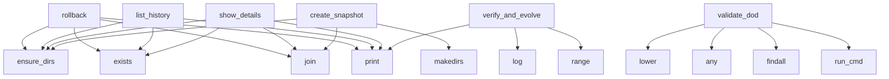

# System Architecture Analysis
<!-- generated in 0.00s -->

## Overview

- **Project**: /home/tom/github/semcod/taskand/glm53
- **Primary Language**: yaml
- **Languages**: yaml: 7, shell: 5, json: 3, python: 3
- **Analysis Mode**: static
- **Total Functions**: 35
- **Total Classes**: 2
- **Modules**: 45
- **Entry Points**: 26

## Architecture by Module

### gateway.Dockerfile
- **Functions**: 8
- **Classes**: 1
- **File**: `Dockerfile`

### history.snapshots.snap-t1789203598.files.taskand.gateway.Dockerfile
- **Functions**: 6
- **Classes**: 1
- **File**: `Dockerfile`

### scripts.digital_twin
- **Functions**: 6
- **File**: `digital_twin.py`

### scripts.history
- **Functions**: 6
- **File**: `history.py`

### Dockerfile
- **Functions**: 2
- **File**: `Dockerfile`

### bootstrap.Dockerfile
- **Functions**: 2
- **File**: `Dockerfile`

### history.snapshots.snap-t1789203598.files.taskand.Dockerfile
- **Functions**: 2
- **File**: `Dockerfile`

### scripts.dod_validator
- **Functions**: 2
- **File**: `dod_validator.py`

### taskand
- **Functions**: 1
- **File**: `taskand.sh`

## Key Entry Points

Main execution flows into the system:

### scripts.history.rollback
- **Calls**: scripts.history.ensure_dirs, os.path.exists, os.path.join, os.path.join, gateway.Dockerfile.print, selected.get, scripts.history.compute_dir_hash, gateway.Dockerfile.print

### scripts.history.list_history
- **Calls**: scripts.history.ensure_dirs, gateway.Dockerfile.print, os.path.exists, gateway.Dockerfile.print, os.path.exists, sorted, gateway.Dockerfile.print, gateway.Dockerfile.print

### scripts.history.show_details
- **Calls**: scripts.history.ensure_dirs, os.path.join, gateway.Dockerfile.print, os.path.exists, os.path.exists, os.listdir, meta.get, gateway.Dockerfile.print

### scripts.history.create_snapshot
- **Calls**: scripts.history.ensure_dirs, os.path.join, os.path.join, os.path.join, os.makedirs, os.path.isdir, scripts.history.compute_dir_hash, gateway.Dockerfile.print

### scripts.digital_twin.verify_and_evolve
> Główna pętla weryfikacji i ewolucji w Digital Twin.
- **Calls**: gateway.Dockerfile.print, scripts.digital_twin.log, gateway.Dockerfile.print, range, scripts.digital_twin.log, dockerfile.exists, scripts.digital_twin.log, scripts.digital_twin.log

### scripts.dod_validator.validate_dod
> Weryfikuje Definition of Done (DoD) na podstawie typu i opisu zadania.
Zwraca (sukces: bool, raport: str).
- **Calls**: task_desc.lower, any, re.findall, scripts.dod_validator.run_cmd, any, scripts.dod_validator.run_cmd, any, scripts.dod_validator.run_cmd

### taskand.safe_curl

### Dockerfile.plan

### Dockerfile.gh_child

### bootstrap.Dockerfile.plan

### bootstrap.Dockerfile.gh_child

### gateway.Dockerfile.parse_yaml_tasks

### gateway.Dockerfile.send_cors_headers

### gateway.Dockerfile.do_OPTIONS

### gateway.Dockerfile.send_json

### gateway.Dockerfile.do_GET

### gateway.Dockerfile.do_POST

### gateway.Dockerfile.log_message

### history.snapshots.snap-t1789203598.files.taskand.gateway.Dockerfile.yaml_value

### history.snapshots.snap-t1789203598.files.taskand.gateway.Dockerfile.send_json

### history.snapshots.snap-t1789203598.files.taskand.gateway.Dockerfile.do_GET

### history.snapshots.snap-t1789203598.files.taskand.gateway.Dockerfile.do_POST

### history.snapshots.snap-t1789203598.files.taskand.gateway.Dockerfile.log_message

### history.snapshots.snap-t1789203598.files.taskand.gateway.Dockerfile.print

### history.snapshots.snap-t1789203598.files.taskand.Dockerfile.plan

### history.snapshots.snap-t1789203598.files.taskand.Dockerfile.gh_child

## Process Flows

Key execution flows identified:

### Flow 1: rollback
```
rollback [scripts.history]
  └─> ensure_dirs
  └─ →> print
```

### Flow 2: list_history
```
list_history [scripts.history]
  └─> ensure_dirs
  └─ →> print
  └─ →> print
```

### Flow 3: show_details
```
show_details [scripts.history]
  └─> ensure_dirs
  └─ →> print
```

### Flow 4: create_snapshot
```
create_snapshot [scripts.history]
  └─> ensure_dirs
```

### Flow 5: verify_and_evolve
```
verify_and_evolve [scripts.digital_twin]
  └─> log
      └─ →> print
  └─> log
      └─ →> print
  └─ →> print
```

### Flow 6: validate_dod
```
validate_dod [scripts.dod_validator]
  └─> run_cmd
```

### Flow 7: safe_curl
```
safe_curl [taskand]
```

### Flow 8: plan
```
plan [Dockerfile]
```

### Flow 9: gh_child
```
gh_child [Dockerfile]
```

### Flow 10: parse_yaml_tasks
```
parse_yaml_tasks [gateway.Dockerfile]
```

## Key Classes

### gateway.Dockerfile.Gateway
- **Methods**: 0

### history.snapshots.snap-t1789203598.files.taskand.gateway.Dockerfile.Gateway
- **Methods**: 0

## Data Transformation Functions

Key functions that process and transform data:

### gateway.Dockerfile.parse_yaml_tasks

### scripts.dod_validator.validate_dod
> Weryfikuje Definition of Done (DoD) na podstawie typu i opisu zadania.
Zwraca (sukces: bool, raport:
- **Output to**: task_desc.lower, any, re.findall, scripts.dod_validator.run_cmd, any

## Public API Surface

Functions exposed as public API (no underscore prefix):

- `scripts.history.rollback` - 59 calls
- `scripts.history.list_history` - 52 calls
- `scripts.history.show_details` - 44 calls
- `scripts.history.create_snapshot` - 33 calls
- `scripts.digital_twin.verify_and_evolve` - 30 calls
- `scripts.digital_twin.ask_llm_for_repair` - 20 calls
- `scripts.digital_twin.create_twin_environment` - 15 calls
- `scripts.digital_twin.run_twin_verification` - 13 calls
- `scripts.history.compute_dir_hash` - 12 calls
- `scripts.dod_validator.validate_dod` - 10 calls
- `scripts.digital_twin.load_env` - 7 calls
- `scripts.dod_validator.run_cmd` - 4 calls
- `scripts.history.ensure_dirs` - 4 calls
- `scripts.digital_twin.log` - 1 calls
- `taskand.safe_curl` - 0 calls
- `Dockerfile.plan` - 0 calls
- `Dockerfile.gh_child` - 0 calls
- `bootstrap.Dockerfile.plan` - 0 calls
- `bootstrap.Dockerfile.gh_child` - 0 calls
- `gateway.Dockerfile.parse_yaml_tasks` - 0 calls
- `gateway.Dockerfile.send_cors_headers` - 0 calls
- `gateway.Dockerfile.do_OPTIONS` - 0 calls
- `gateway.Dockerfile.send_json` - 0 calls
- `gateway.Dockerfile.do_GET` - 0 calls
- `gateway.Dockerfile.do_POST` - 0 calls
- `gateway.Dockerfile.log_message` - 0 calls
- `gateway.Dockerfile.print` - 0 calls
- `history.snapshots.snap-t1789203598.files.taskand.gateway.Dockerfile.yaml_value` - 0 calls
- `history.snapshots.snap-t1789203598.files.taskand.gateway.Dockerfile.send_json` - 0 calls
- `history.snapshots.snap-t1789203598.files.taskand.gateway.Dockerfile.do_GET` - 0 calls
- `history.snapshots.snap-t1789203598.files.taskand.gateway.Dockerfile.do_POST` - 0 calls
- `history.snapshots.snap-t1789203598.files.taskand.gateway.Dockerfile.log_message` - 0 calls
- `history.snapshots.snap-t1789203598.files.taskand.gateway.Dockerfile.print` - 0 calls
- `history.snapshots.snap-t1789203598.files.taskand.Dockerfile.plan` - 0 calls
- `history.snapshots.snap-t1789203598.files.taskand.Dockerfile.gh_child` - 0 calls

## System Interactions

How components interact:



## Reverse Engineering Guidelines

1. **Entry Points**: Start analysis from the entry points listed above
2. **Core Logic**: Focus on classes with many methods
3. **Data Flow**: Follow data transformation functions
4. **Process Flows**: Use the flow diagrams for execution paths
5. **API Surface**: Public API functions reveal the interface

## Context for LLM

Maintain the identified architectural patterns and public API surface when suggesting changes.